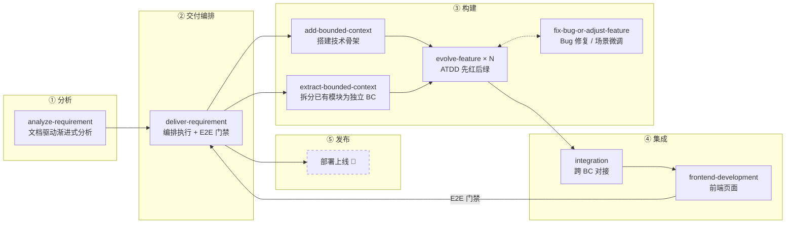

# AI 辅助开发：方法、流程与 Skill

> **开发领域模型**：本文档使用的所有核心概念（BoundedContext、EventFlow、DomainModel、Feature（特性）、AcceptanceTest、Implementation 等）的定义与关系见 [`domain-model.md`](./domain-model.md)。它是 Skill 体系的术语基础。

## 核心思路

我们将软件开发分为**问题域**和**解决方案域**：

- **问题域**：精确定义业务——业务如何运转、由什么概念构成、系统应有什么行为
- **解决方案域**：将定义变为可运行的软件——契约、测试、实现代码

在 AI 辅助开发中，开发者的核心工作是**精确定义问题**。当业务流程、领域模型和需求被清晰地表达后，解决方案域的工作可以更多地交由 AI 完成。问题定义得越精确，AI 生成的结果就越可靠、越可验证。

## 问题域的三个核心资产

问题域的精确定义依赖三个核心资产，它们也是分析阶段的主要产出：

**事件驱动的业务流程**（→ `event-flow.md`）——业务流程描述了业务的具体运转方式，而事件是流程中发生的、具有业务意义的事实。事件不仅记录了系统当前的状态，更记录了我们是如何一步步达成这个状态的。在分析中，事件是一等公民：通过基于事件来分析业务流程，我们以「以终为始」的方式，从业务目标出发反向推导每一步，使流程定义天然完整。同时，事件也是运行时架构的基础——通过 Kafka 事件解耦各限界上下文，实现异步编排、可追溯与可监控。

**领域模型**（→ `domain-model.md`）——描述系统中的核心概念、属性、关系及约束（不变式）。它代表了团队对业务的根本认知，是业务、产品和技术之间的共同语言。当领域模型清晰、代码实现与模型保持一致时，代码就不再是对需求的二次翻译，而是模型的直接映射——这使得 AI 的代码生成既高效又可靠。

**特性与场景**（Feature & Scenario）（→ `requirements.md` / `.feature`）——特性由场景组成，每个场景精确描述系统在特定条件下的对外行为和承诺。它是连接问题域与解决方案域的桥梁：在问题域中消除自然语言的模糊性；在解决方案域中直接成为验收测试——测试基于场景编写，通过即为需求达成，失败即为行为偏离。

## 三个方法

围绕上述核心资产，三个方法各司其职：

- **事件驱动分析与架构**：以领域事件为起点驱动整个分析过程——通过事件流发现业务流程，进而识别限界上下文的边界、发现核心领域对象、设计跨 BC 的编排与补偿机制。事件驱动分析为领域建模和上下文划分提供基础。在运行时，事件驱动架构通过 Kafka 解耦各 BC，实现异步编排与可监控性。
- **DDD（领域驱动设计）**：在事件驱动分析的基础上，用限界上下文划分业务边界，用领域模型驱动设计，确保代码结构与业务语言一致。
- **ATDD（验收测试驱动开发）**：每个特性从验收场景出发，先写测试、再写实现，保证交付行为与需求严格对齐。验收场景既是需求的精确表达，也是 AI 生成代码的验证标准。

## 开发流程

一个特性从分析到上线的完整链路：

```mermaid
flowchart LR
    subgraph A["① 分析（问题域）"]
        A1["事件流分析<br/>(event-flow)"]
        A2["领域建模<br/>(domain-model)"]
        A3["特性编写<br/>(Feature/Scenario)"]
        A1 --> A2 --> A3
    end

    subgraph B["② 构建（解决方案域）"]
        B1["验收场景<br/>(.feature)"]
        B2["实现代码<br/>(先红后绿)"]
        B3["测试通过"]
        B1 --> B2 --> B3
    end

    subgraph C["③ 集成"]
        C1["跨 BC 对接"]
        C2["前端对接"]
        C1 --> C2
    end

    subgraph D["④ 交付验收"]
        D1["E2E 交付门禁<br/>(Smoke + Business E2E)"]
        D2["开发者确认"]
        D1 --> D2
    end

    subgraph E["⑤ 发布"]
        E1["部署上线 🔲"]
    end

    A3 --> B1
    B3 --> C1
    C2 --> D1
    D2 --> E1

    style E1 stroke-dasharray: 5 5
```



> **交付验收**通过 `deliver-requirement` Skill 编排，包含 Smoke E2E 回归 + Business E2E 验收 + 开发者确认三道门禁。**部署上线**（虚线框）为待完善部分，计划包括：容器化部署、CI/CD 流水线。

## Skill 体系

每个 Skill 对应流程中的一个阶段，通过文档作为衔接接口：



### 各 Skill 说明

| Skill | 定位 | 核心流程 | 产出 |
|-------|------|---------|------|
| **analyze-requirement** | 文档驱动的渐进式需求分析。逐章节写入 overview.md，每章写完即轻量确认——设计过程即文档编写过程 | 需求概述与场景 → 场景分析（事件流） → 变更分析 → 迭代计划（每章写入 overview 对应章节并确认） | `docs/business-requirements/<name>/overview.md` + 各 BC 文档增量变更（Phase B） |
| **deliver-requirement** | 编排业务需求的交付。从迭代计划出发，按依赖顺序调度各 Skill，跟踪完成进度，并通过 E2E 交付门禁确保链路可用 | 读取迭代计划 → 按序调度各 Skill → E2E 交付门禁（Smoke 回归 + Business E2E + 开发者确认）→ 迭代/需求收尾 | 交付跟踪（在 overview.md 中）、Business E2E、Smoke 评估 |
| **add-bounded-context** | 为新 BC 搭建技术骨架。不含业务代码，仅保证 `mvn test` 可运行 | 读参考模板 → 创建四层包结构 → 测试脚手架 → API 契约 → 更新脚本与文档 | 可编译运行的空 BC，冒烟测试通过 |
| **extract-bounded-context** | 从已有服务中拆分出独立 BC。搬迁代码与测试，清理宿主，全程双侧绿色 | 文档拆分 → 新 BC 骨架 → 代码搬迁 → 测试迁移 → 宿主清理 → 脚本与文档更新 | 独立的新 BC（测试全绿）+ 清理后的宿主（测试全绿） |
| **evolve-feature** | 在已有 BC 内演进特性，严格遵循 ATDD。最常用的 Skill | ① 特性与模型确认 → ② 契约与测试先红 → ③ 实现变绿 → 清理与重构 | 通过验收的特性代码、更新的契约与文档 |
| **integration** | 跨 BC 对接。同步调用或异步事件，由 `event-flow.md` 决定。验收用 Stub，真实适配器条件激活 | 确认契约 → 实现适配器 → 配置条件 Bean → 验收保持全绿 | REST 适配器和/或 Kafka 消费者、配置 |
| **fix-bug-or-adjust-feature** | 已有特性的缺陷修复或场景微调。不涉及新的领域建模或跨 BC 影响分析 | 定位根因 → 测试先红 → 实现变绿 → 同步文档 | 修复后的代码、更新的测试与文档 |
| **frontend-development** | 实现或扩展前端页面。需求优先、契约对齐、不重复后端业务规则 | 确定/更新界面规格 → 实现页面 → 自动化验证（build + Smoke E2E） → 开发者确认 | 前端页面、更新的 ui-spec、Smoke E2E 全绿 |
| **mcp-development** | 为 BC 设计并实现 MCP tools，暴露 AI 可调用的能力 | API 分类与暴露范围分析 → 设计 MCP tools → 实现与 schema → 验证与文档同步 | MCP Tools 实现与文档 |
| **bc-audit** | 审计指定 BC 的信任链完整性（问题域↔解决方案域对齐），产出分级整改清单 | 建立基线 → 三维审计（问题域完整性/链条对齐/集成边界）→ 分级输出 | 信任链评估、分级整改清单、补测建议 |

### 场景与 Skill 组合

| 场景 | Skill 组合 |
|------|-----------|
| 新建 BC | analyze-requirement → deliver-requirement（编排：add-bounded-context → evolve-feature × N → integration → E2E 门禁） |
| 从已有服务拆分 BC | [analyze-requirement →] deliver-requirement（编排：extract-bounded-context → evolve-feature × N → E2E 门禁） |
| 业务需求（涉及一个或多个 BC） | analyze-requirement → deliver-requirement（编排：evolve-feature × N → [integration] → [frontend] → E2E 门禁） |
| 演进单个特性 | evolve-feature |
| 修复 Bug 或小幅调整 | fix-bug-or-adjust-feature |
| 跨 BC 对接 | integration |
| 前端页面开发 | frontend-development |
| BC 质量巡检 / 治理盘点 | bc-audit |

### ⚠️ Skill 流程不可绕过

**任何涉及领域模型、特性、验收测试或 API 契约的变更，都必须通过对应的 Skill 执行。** 即使是在对话讨论中产生的变更决策，也必须先明确对应的 Skill、读取并走完其完整流程——而不是"顺手改代码"。

分析阶段（`analyze-requirement`）只产出文档，不产出代码。代码实现必须切换到 `evolve-feature` 等 Skill。

### 如何选择 Skill

```
需要做什么？
  ├── 分析一个业务需求（新建 BC / 重大演进 / 跨 BC）→ analyze-requirement
  ├── 交付一个已分析完的业务需求（编排执行 + E2E 验收）→ deliver-requirement
  ├── 从已有服务拆分模块为独立 BC → extract-bounded-context
  ├── 演进一个特性（已知改哪个 BC 的哪个 Feature）→ evolve-feature
  ├── 修 Bug 或小幅调整 → fix-bug-or-adjust-feature
  ├── 对接两个 BC → integration
  ├── 前端页面 → frontend-development
  └── 做 BC 质量审计/治理盘点 → bc-audit
```
