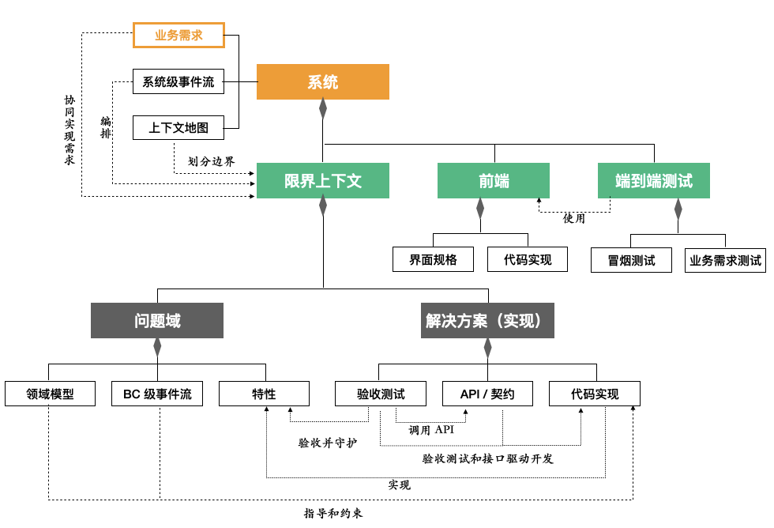

# 开发领域模型

本文档定义 **AI 辅助开发方法** 自身的领域模型——即我们开发过程中操作的核心概念、它们的属性与关系。

它是 Skill 体系的术语基础。所有 Skill 的输入、产出、前置/后置条件均使用本模型中的概念来描述。

---

## 领域模型图

图中只展示核心概念及其一级关系。各概念的内部组成见下方「概念定义」。

**图例说明**：

- **系统级**（上方）：业务需求、系统级事件流、上下文地图与系统的关系
  - 业务需求 → 各个限界上下文协同实现需求
  - 系统级事件流 → 编排各个限界上下文
  - 上下文地图 → 划分边界
- **限界上下文**（中间枢纽）：连接问题域与解决方案域
- **问题域**（左下）：领域模型、BC 级事件流、特性——属于限界上下文内部
- **解决方案域 / 实现**（右下）：验收测试、API 契约、代码实现——属于限界上下文内部
  - 特性 → 验收并守护 → 验收测试
  - 验收测试 → 调用 API → API 契约
  - 验收测试 + API 契约 → 验收测试和接口驱动开发 → 代码实现
  - 领域模型 → 实现 → 代码实现
- **前端**（右侧）：与限界上下文并列，属于系统级；持有界面规格和代码实现

---

## 整体结构

| 层级 | 职责 |
|------|------|
| **系统级** | 业务需求、系统级事件流、上下文地图——系统的全局视角 |
| **限界上下文级** | 限界上下文持有问题域与解决方案域两类资产：问题域精确定义业务（领域模型、BC 级事件流、特性）；解决方案域将定义变为可运行的软件（验收测试、API 契约、代码实现） |
| **前端** | 前端是后端限界上下文产出的消费者，将多个 BC 的 API 契约组合为用户可交互的界面。持有界面规格和代码实现两类资产 |

---

## 概念定义

### 系统级

| 概念 | 说明 | 对应文件 |
|------|------|----------|
| **业务需求（BusinessRequirement）** | 跨 BC 的系统级业务需求，由各个限界上下文协同实现。包含全局事件流、设计决策、迭代计划。落地到各 BC 时，表现为已有特性的增量变更或新增特性 | `docs/business-requirements/<name>/overview.md` |
| **系统级事件流（BusinessProcess）** | 系统级的端到端事件流，是系统交付价值的方式。编排多个 BC，数量有限且稳定（如交易流程、导购流程、用户发展流程、活动运营流程）。BC 内部的事件流是系统级事件流在该 BC 内的投影。不归属于任何单个 BC，是系统的一等公民 | 当前暂存于编排中心 BC 的 event-flow（如交易流程在 Order 的 `event-flow.md`），待独立为系统级文档 |
| **上下文地图（ContextMap）** | 定义所有 BC 的边界、集成关系（上游/下游、防腐层、共享内核等）、集成方式（REST 同步 / Kafka 异步）、事件总表 | `docs/context-map.md` |

### 限界上下文（BoundedContext）——枢纽

| 概念 | 说明 | 对应文件 |
|------|------|----------|
| **限界上下文（BoundedContext）** | 核心聚合根。有生命周期：规划 → 分析 → 骨架就绪 → 演进中 → 集成 → 发布。持有问题域和解决方案域的全部资产 | `docs/bounded-contexts/<bc>/` |

### 问题域（BC 内部）

问题域**精确定义业务**——业务由什么概念构成、如何运转、系统对外承诺什么行为。

| 概念 | 说明 | 对应文件 |
|------|------|----------|
| **领域模型（DomainModel）** | 业务概念、属性、关系与约束的结构化表达，是业务、产品和技术之间的共同语言 | `docs/bounded-contexts/<bc>/domain-model.md` |
| **BC 级事件流（EventFlow）** | BC 内部的事件因果链——以领域事件为一等公民描述 BC 内的流程：事件→命令因果链、策略（Policy）、主流程与补偿/逆向流程。是系统级事件流在该 BC 内的投影 | `docs/bounded-contexts/<bc>/event-flow.md` |
| **特性（Feature）** | BC 对外的行为承诺，由场景（Given/When/Then）组成。特性是常青的（Evergreen），随着业务演进持续增加、修改或移除场景 | `docs/bounded-contexts/<bc>/requirements.md`（文件名为 requirements，承载的内容是特性） |

#### 领域模型内部组成

| 概念 | 说明 |
|------|------|
| **聚合（Aggregate）** | 一致性边界，由一个聚合根和若干实体、值对象组成，共同维护一组不变式 |
| **聚合根（AggregateRoot）** | 聚合的唯一入口，本身是特殊的实体，外部只能通过它访问聚合内部 |
| **实体（Entity）** | 有唯一标识、有生命周期的领域对象 |
| **值对象（ValueObject）** | 无标识、不可变，由属性值定义相等性 |
| **领域服务（DomainService）** | 处理不自然归属于任何单个聚合的业务逻辑 |
| **不变式（Invariant）** | 聚合必须始终满足的业务约束规则 |
| **领域事件（DomainEvent）** | 聚合产生的、表达已发生业务事实的事件。事件在事件流中描述因果关系，在领域模型中定义其结构 |

#### 特性内部组成

| 概念 | 说明 |
|------|------|
| **场景（Scenario）** | 以 Given/When/Then 形式精确描述系统在特定条件下的行为承诺 |

### 解决方案域（BC 内部）

解决方案域**将定义变为可运行的软件**——测试、契约、代码。

| 概念 | 说明 | 对应文件 |
|------|------|----------|
| **验收测试（AcceptanceTest）** | 特性在解决方案域的可执行表达，包含特性文件和步骤定义。验收并守护特性的行为承诺，通过调用 API 契约来测试 | 特性文件: `features/<bc>/*.feature`；步骤定义: `services/<bc>-service/src/test/**/steps/` |
| **API 契约（ApiContract）** | OpenAPI YAML 定义的 Path、Request、Response，与领域模型的属性对齐。验收测试和代码实现的共同接口依据 | `docs/bounded-contexts/<bc>/api.yaml` |
| **代码实现（Implementation）** | 按四层架构组织的实现代码，由验收测试和接口驱动开发，将领域模型映射为可运行的系统 | `services/<bc>-service/src/main/java/com/hmall/<bc>/` |

#### 验收测试内部组成

| 概念 | 说明 |
|------|------|
| **特性文件（FeatureFile）** | `.feature` 文件。场景的 Gherkin 可执行表达，与特性中的场景一一对应 |
| **步骤定义（StepDefinition）** | 场景的技术实现，按 API 契约调用后端 API |

#### 代码实现内部组成（四层架构）

| 层 | 说明 |
|----|------|
| **API 层** | REST Controller、DTO、异常处理 |
| **应用层（Application）** | 应用服务（用例编排、事务）、端口接口（出站端口） |
| **领域层（Domain）** | 实体、值对象、领域服务、仓储接口的代码实现，无外部依赖 |
| **基础设施层（Infrastructure）** | 仓储实现（RepositoryImpl）、JPA Entity、Kafka Publisher/Consumer |

### 前端（Frontend）

前端是后端限界上下文产出的**消费者**——它不定义业务规则，而是将多个 BC 的 API 契约组合为用户可交互的界面。前端不区分问题域与解决方案域，结构更简洁，持有两类资产。

| 概念 | 说明 | 对应文件 |
|------|------|----------|
| **界面规格（UISpec）** | 前端应用的完整设计资产，一份文档统一描述该前端的全貌：页面规格、组件结构、视觉规范。是前端开发的唯一设计依据 | `docs/frontend/<app>/ui-spec.md` |
| **代码实现（Implementation）** | Vue 组件、路由、API 封装、样式等前端代码 | `frontend/<app>/src/` |

#### 界面规格内部组成

| 部分 | 说明 |
|------|------|
| **定位与范围** | 该前端应用做什么、不做什么、面向什么用户 |
| **页面规格（PageSpec）** | 每个页面的路由、功能、交互行为、调用的后端 API。这是界面规格的核心部分——描述前端「做什么」 |
| **组件结构（ComponentStructure）** | 按 Atomic Design 分层的组件清单（原子/分子/有机体），以及每个页面由哪些组件组成。描述前端「怎么组织」 |
| **视觉规范（VisualStyle）** | 色彩体系、布局规则、间距、字体等设计风格约定。描述前端「长什么样」 |
| **技术栈** | 框架、样式方案、请求库、代理配置等技术约定 |

#### 代码实现内部组成

| 部分 | 说明 |
|------|------|
| **页面（Pages）** | Vue Router 路由对应的页面组件 |
| **组件（Components）** | 按 Atomic Design 分层的可复用 UI 组件 |
| **API 封装（API Layer）** | 对后端 API 契约的调用封装（axios 等） |
| **组合式逻辑（Composables）** | 可复用的业务逻辑（Vue Composables） |

---

## 关键关系

| 关系 | 说明 |
|------|------|
| 业务需求 → 限界上下文 | 各个限界上下文协同实现业务需求 |
| 系统级事件流 → 限界上下文 | 系统级事件流编排各个限界上下文 |
| 上下文地图 → 限界上下文 | 上下文地图划分 BC 边界 |
| 系统级事件流 → BC 级事件流 | 系统级事件流在 BC 内的投影即为 BC 级事件流 |
| 业务需求 → 特性 | 业务需求落地为各 BC 中已有特性的增量变更或新增特性 |
| 特性 → 验收测试 | 特性被验收测试**验收并守护** |
| 验收测试 → API 契约 | 验收测试**调用 API** |
| 验收测试 + API 契约 → 代码实现 | **验收测试和接口驱动开发** |
| 领域模型 → 代码实现 | 领域模型**映射**为代码**实现** |
| 前端 → API 契约 | 前端**消费**后端 BC 的 API 契约 |
| 业务需求 → 界面规格 | 业务需求落地为前端界面规格中的页面新增或变更 |

---

## 开发方法

开发方法描述**如何操作**上述领域对象，由三个概念组成：

| 概念 | 说明 | 对应文件 |
|------|------|----------|
| **开发流程（DevelopmentProcess）** | 从分析到发布的完整链路，由阶段按顺序串联 | `.cursor/skills/README.md` |
| **阶段（Phase）** | 开发流程的一个阶段：① 分析、② 构建、③ 集成、④ 发布 | — |
| **技能（Skill）** | 操作指南。对应流程中某个阶段的具体操作，有明确的适用场景、输入（消费哪些领域对象）、步骤序列、产出（产生/变更哪些领域对象） | `.cursor/skills/<skill>/SKILL.md` |

### 技能的输入与产出

每个技能操作限界上下文或前端中的领域对象（详见各技能的 SKILL.md）：

| 技能 | 输入 | 产出 |
|------|------|------|
| **analyze-requirement** | 用户需求、上下文地图、已有 BC 文档 | 业务需求方案（overview）+ 各 BC 的事件流、领域模型、特性变更 |
| **add-bounded-context** | 分析产出（领域模型、特性） | 代码实现骨架、验收测试脚手架、API 契约 |
| **extract-bounded-context** | 已有 BC 的代码实现、拆分方案 | 独立的新限界上下文 + 清理后的宿主限界上下文 |
| **evolve-feature** | 特性、领域模型、API 契约 | 验收测试（先红）、代码实现（后绿）；反向更新领域模型和 API 契约 |
| **fix-bug-or-adjust-feature** | 缺陷/调整描述、已有验收测试 | 修复后的代码实现与验收测试 |
| **integration** | BC 级事件流、API 契约（上下游双方） | 代码实现的基础设施层适配器（REST/Kafka） |
| **frontend-development** | 界面规格、API 契约 | 前端代码实现 |
