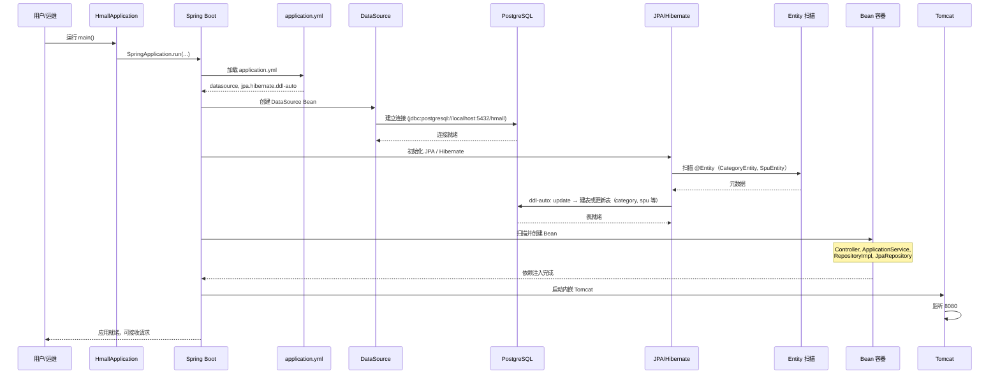
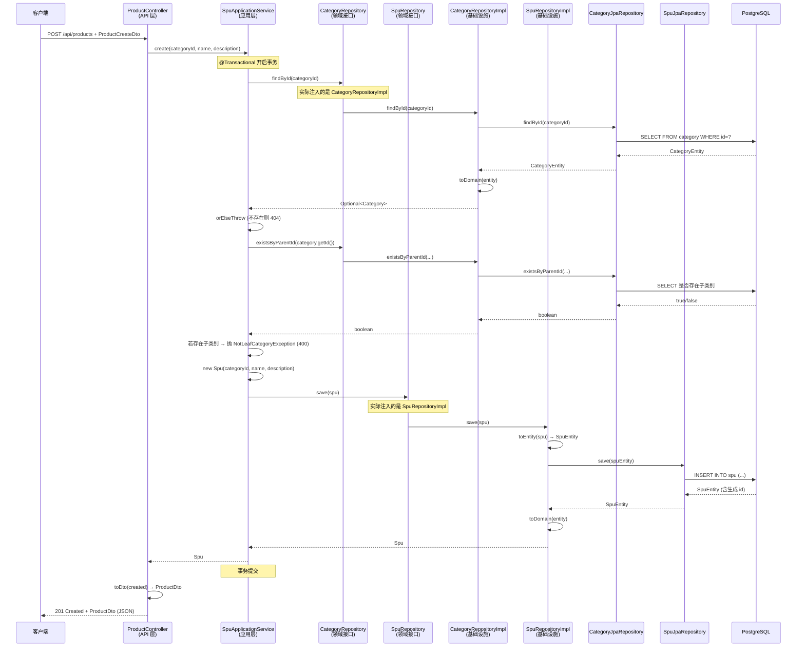

# 商品限定上下文 - 两个调用场景图

> 用 Mermaid 画的调用顺序图，可在支持 Mermaid 的 Markdown 预览中查看（如 VS Code、GitHub、Cursor）。

---

## 场景一：应用启动时做了什么（调用顺序）

应用启动时的大致顺序：加载配置 → 连接数据库 → Hibernate 建表/更新表 → 注册 Bean → 启动 Web 容器。

---

## 场景二：调用「创建商品」接口时的调用关系

假设客户端发送：`POST /api/products`，body 为 `{ "categoryId": 1, "name": "商品A", "description": "..." }`。

各层之间的调用顺序与模块关系如下。

---

## 模块归属小结（场景二）

| 步骤 | 所在层 | 说明 |
|------|--------|------|
| 接收 DTO、调 ApplicationService、转 DTO 返回 | API (catalog.api) | Controller |
| 事务、校验（类别存在、叶子）、new Spu、调 Repository | 应用 (catalog.application) | SpuApplicationService |
| Category / Spu、Repository 接口 | 领域 (catalog.domain) | 无直接「调用」，由应用层使用 |
| findById / existsByParentId / save 的实现、Entity ↔ Domain 转换 | 基础设施 (catalog.infrastructure) | *RepositoryImpl |
| 真正执行 SQL | 基础设施 (JpaRepository + Hibernate) | 访问 PostgreSQL |

如需导出为图片，可使用 [Mermaid Live Editor](https://mermaid.live) 或 VS Code 的 Mermaid 插件。
