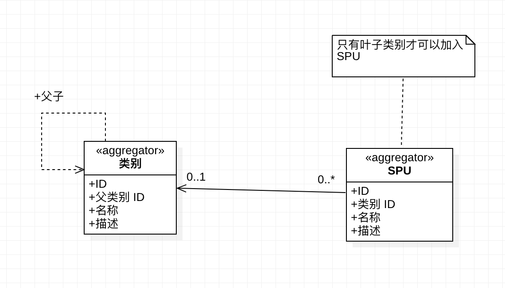

# 商品限定上下文 - 领域模型

> 阶段零产出之一；与需求列表相互对照。实现时以本文档为准。

---

## 领域模型图

---

## 1. 聚合与实体

### 1.1 类别（Category）— 聚合根

| 属性     | 类型   | 说明 |
|----------|--------|------|
| ID       | Long   | 唯一标识 |
| 父类别 ID | Long   | 根类别为 null；有值则指向父类别，形成树 |
| 名称     | String | 必填 |
| 描述     | String | 可选 |

- **子类别**：不存储；由「父类别 ID = 本类别 ID」查询得出。无子即为叶子节点。

### 1.2 SPU（商品）— 聚合根

| 属性   | 类型 | 说明 |
|--------|------|------|
| ID     | Long | 唯一标识 |
| 类别 ID | Long | 所属类别，必填 |
| 名称   | String | 必填 |
| 描述   | String | 可选 |

- 当前不做价格；后续可加。
- 与类别关系：多对一（多个 SPU 属一个类别）；SPU 只存类别 ID，不持有关联对象。

---

## 2. 关系

- **类别 ↔ 类别**：树形，每节点存父类别 ID；子类别通过 `parent_id = ?` 查询。
- **SPU → 类别**：SPU 存 `类别 ID`；一个类别下可有多个 SPU（0..*），一个 SPU 只属一个类别（0..1）。

---

## 3. 不变式

- **只有叶子类别才可以加入 SPU**  
  创建商品时，`类别 ID` 必须指向当前**没有子类别**的类别；若有子类别则拒绝创建并提示。
- **类别**：名称必填；父类别 ID 要么 null（根），要么指向已存在类别。
- **SPU**：名称、类别 ID 必填；描述可选。

---

## 4. 实现对照（与代码同步）

- **Category**：`com.hmall.catalog.domain.Category`。两构造：`(parentId, name, description)` 新建、`(id, parentId, name, description)` 持久化还原；`isRoot()` 即 `parentId == null`。
- **Spu**：`com.hmall.catalog.domain.Spu`。两构造：`(categoryId, name, description)` 新建、`(id, categoryId, name, description)` 持久化还原。
- **不变式落实**：类别名称/父类别存在性在应用层 `CategoryApplicationService` 校验；「仅叶子类别可挂 SPU」在 `SpuApplicationService.create` 中通过 `existsByParentId(categoryId)` 校验，违规则抛 `NotLeafCategoryException`（API 层映射为 400）。

---

## 5. 与需求的对应

- 需求「管理类别」→ 本模型中的 Category 聚合（创建根/子、查询根下/某类别下子类别）。
- 需求「管理商品」→ 本模型中的 Spu 聚合（在叶子类别下创建、按类别/ID 查询）；不变式对应需求 2.2「在非叶子类别下创建商品应失败」。
