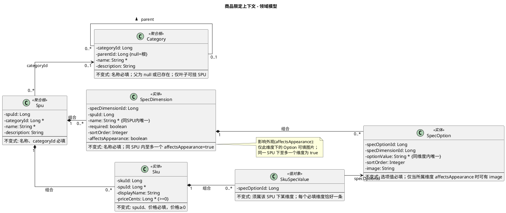

# 商品限定上下文 - 领域模型

与需求、契约对照；实现以本文档为准。

---

## 模型图（PlantUML）

修改模型时改此处即可；渲染见 [PlantUML](https://www.plantuml.com/plantuml) 或 IDE 插件。

---

## 实体与属性说明

### 类目（Category）— 聚合根

| 属性       | 类型   | 说明 |
|------------|--------|------|
| CategoryID | Long   | 唯一标识 |
| 父类目 ID  | Long   | 根为 null，形成树 |
| 名称       | String | 必填 |
| 描述       | String | 可选 |

**不变式**：名称必填；父类目 ID 为 null（根）或已存在类目；只有叶子类目才可以加入 SPU（创建 SPU 时校验）。

### SPU — 聚合根

| 属性       | 类型   | 说明 |
|------------|--------|------|
| SpuID      | Long   | 唯一标识 |
| CategoryID | Long   | 所属类目，必填 |
| 名称       | String | 必填 |
| 描述       | String | 可选 |

组合 SpecDimension、SKU。**不变式**：名称、CategoryID 必填；描述可选。

#### SpecDimension — 实体

| 属性            | 类型    | 说明 |
|-----------------|---------|------|
| SpecDimensionID | Long    | 唯一标识 |
| SpuID           | Long    | 所属 SPU |
| 维度名称        | String  | 必填，同 SPU 内唯一 |
| 是否必填        | boolean | 创建 SKU 时是否必选 |
| 排序            | Integer | 可选 |
| 影响外观        | boolean | 该维度的 Option 才允许填图片；同 SPU 下至多一个为 true |

组合 SpecOption（0..*）。**不变式**：维度名称必填、同 SPU 内唯一；下至少一个 SpecOption；同一 SPU 下至多一个「影响外观」为 true。

#### SpecOption — 实体

| 属性            | 类型   | 说明 |
|-----------------|--------|------|
| SpecOptionID    | Long   | 唯一标识 |
| SpecDimensionID | Long   | 所属维度 |
| 选项值          | String | 必填，同维度内唯一 |
| 排序            | Integer| 可选 |
| 图片            | String | 可选（仅当所属维度「影响外观」为 true 时） |

**不变式**：选项值必填、同维度内唯一；仅当所属维度「影响外观」为 true 时方可填图片。

#### SKU — 实体

| 属性       | 类型   | 说明 |
|------------|--------|------|
| SkuID      | Long   | 唯一标识，全局唯一 |
| SpuID      | Long   | 所属 SPU，必填 |
| 规格展示名 | String | 可选 |
| 价格       | Long   | 单位：分，必填、≥0 |

组合 SKUSpecValue（0..*）。**不变式**：SpuID、价格必填，价格≥0。

#### SKUSpecValue — 值对象

| 属性         | 类型 | 说明 |
|--------------|------|------|
| SpecOptionID | Long | 选中的 SpecOption |

**不变式**：SpecOptionID 须属该 SPU 下某 SpecDimension；每个必填维度恰好一条。

---

## 实体与表

| 模型 | 表名 |
|------|------|
| Category | category |
| Spu | spu |
| SpecDimension | spec_dimension |
| SpecOption | spec_option |
| Sku | sku |
| SKUSpecValue | sku_id + spec_option_id |

不变式由应用层校验。
