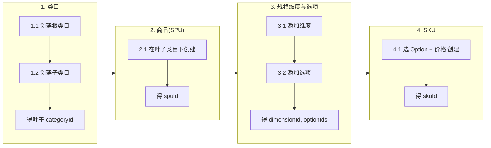

# 商品限定上下文 - 需求列表

每个功能对应一个 .feature 文件，场景对应 Gherkin Scenario。契约：`catalog-api.yaml`。Feature 目录：`backend/src/test/resources/features/catalog/`。

### 主路径示意（操作顺序）

顺序：类目 → SPU → 维度与选项 → SKU；上一步产出的 ID 为下一步输入。

---

## 1. 管理类目  
`category.feature`

- 1.1 创建根级类目时应成功并返回名称且无父类目
- 1.2 在已有类目下创建子类目时应成功并返回名称及父类目
- 1.3 请求根下所有类目时应返回类目列表
- 1.4 请求某类目下子类目时应返回子类目列表
- 1.5 父类目不存在时创建子类目应失败并返回 404

---

## 2. 管理商品  
`product.feature`

- 2.1 在叶子类目下创建商品时应成功并返回商品信息
- 2.2 在非叶子类目下创建商品时应失败并返回错误提示
- 2.3 按类目请求该类目下商品时应返回商品列表
- 2.4 按 ID 请求商品详情时应返回商品信息
- 2.5 删除已存在的商品时应成功且再次查询返回 404；删除不存在的商品时应返回 404
- 2.6 类目不存在时创建商品应失败并返回 404
- 2.7 请求不存在的商品详情时应返回 404

---

## 3. 管理 SPU 规格维度与选项  
`spec-dimension.feature`

先为 SPU 配置维度（如容量、颜色）及每维度下的可选项（如 128G/256G、黑/白），后续创建 SKU 时从各维度选一 Option 组合。

- 3.1 为 SPU 添加规格维度时应成功并返回维度名称
- 3.2 为维度添加可选项时应成功并返回选项值
- 3.3 为影响外观的维度添加带图片的选项时应成功并返回选项及图片
- 3.4 请求某 SPU 下维度及选项时应返回维度列表及选项
- 3.5 请求维度及选项且选项有图片时应返回选项图片
- 3.6 SPU 不存在时添加维度应失败并返回 404
- 3.7 同 SPU 内维度名称重复时添加维度应失败并返回错误提示
- 3.8 同维度内选项值重复时添加选项应失败并返回错误提示
- 3.9 维度不存在时添加选项应失败并返回 404

---

## 4. 管理 SKU  
`sku.feature`

SKU = 每个必填维度选一 Option + 价格（分）。规格展示名可自动生成或可选。

- 4.1 在 SPU 下选齐必填 Option 及价格创建 SKU 时应成功并返回 SKU 信息
- 4.2 SPU 不存在时创建 SKU 应失败并返回 404
- 4.3 未选齐必填维度时创建 SKU 应失败并返回错误提示
- 4.4 按 SPU 请求该 SPU 下 SKU 时应返回 SKU 列表
- 4.5 按 SPU 与 SKU ID 请求详情时应返回 SKU 信息
- 4.6 传入不属于该 SPU 的 Option 时创建 SKU 应失败并返回错误提示
- 4.7 价格为负数时创建 SKU 应失败并返回错误提示
- 4.8 请求不存在的 SKU 详情时应返回 404

---

## 功能与 feature 对应

| 功能 | .feature 文件 |
|------|----------------|
| 1. 管理类目 | category.feature |
| 2. 管理商品 | product.feature |
| 3. 管理 SPU 规格维度与选项 | spec-dimension.feature |
| 4. 管理 SKU | sku.feature |
