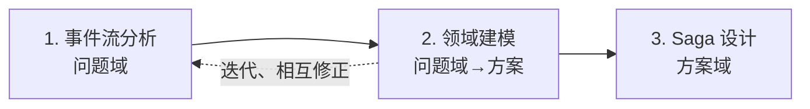

# 事件驱动的业务分析

本文档描述以事件为核心的业务分析方法，适用于跨限界上下文（BC）的复杂流程分析与设计，尤其是订单、交易等编排型场景。

---

## 一、适用的问题

事件驱动的业务分析主要解决以下类型的问题：

| 问题类型 | 说明 |
|----------|------|
| **跨 BC 的流程编排** | 一笔业务需协调多个限界上下文（如 Order 协调 Catalog、Payment、Fulfillment），需要清晰描述流程与依赖 |
| **异步与最终一致性** | 各 BC 独立数据库，无法用分布式事务保证强一致，需要事件驱动、补偿机制 |
| **统一的分析语言** | 从业务分析到架构设计，希望用同一种思维（事件）贯穿，减少断层 |

典型场景：订单从创建 → 支付 → 履约的完整流程，以及取消、退款等逆向流程。（注：HMall 中库存、支付创建采用同步调用，不参与事件链；支付完成由网关回调驱动，Payment 发布 PaymentCompleted 等事件。）

---

## 二、分析过程

整体流程：**事件优先发现 → 领域建模（关联事件与对象）→ Saga 设计**。三者迭代，而非一次性线性完成。

---

### 步骤 1：事件流分析（问题域）

**目标**：发现业务中发生的「事情」，建立时间线与因果关系。

**方法**：
- 使用 **Event Storming** 或类似工作坊，在时间线上贴出领域事件（橙色）
- 补充命令（蓝色）、策略「当 X 发生则做 Y」（淡紫）、聚合（黄色）
- 区分主流程事件与旁支事件

**产出**：
- 主流程事件链：`OrderCreated → PaymentCompleted → FulfillmentOrderCreated → ...`（库存占用为 Order 创建时的同步步骤）
- 逆向/补偿事件链：`OrderCancelled ← InventoryReleased ← PaymentRefunded ← ...`
- 事件与命令、策略的对应关系

**注意**：此阶段不必强求「事件名与领域对象一一对应」，先以业务语言表达清楚即可。

---

### 步骤 2：领域建模（问题域 → 方案域）

**目标**：识别聚合、实体、值对象，明确事件与领域对象的归属关系。

**方法**：
- 为每个事件追问：「这件事发生在哪个业务对象上？」
- 识别聚合根、子对象（如 Order / OrderLineItem / PaymentRef / FulfillmentRef）
- 将事件归类到对应聚合，统一命名规范（如 `{聚合}{动作过去式}`：OrderCreated、PaymentCompleted）

**产出**：
- 领域模型图（聚合、实体、关系）
- 事件清单（含所属聚合）
- 各聚合的状态/生命周期（可用「事件驱动」表达：状态 = 已应用事件的累积结果）

**迭代**：建模过程中会反哺事件流——发现缺失事件、合并或拆分事件、规范事件名称。这种反复是正常且有益的。

---

### 步骤 3：Saga 设计（方案域）

**目标**：将事件流转化为可实现的分布式事务方案，含补偿机制。

**方法**：
- 主流程事件链 → Saga 正向步骤（T1, T2, T3, ...）
- 逆向事件链 → 补偿步骤（C1, C2, C3, ...），顺序与正向相反
- 明确每个步骤：触发事件、执行 BC、产出事件、补偿动作

**产出**：
- Saga 步骤表
- Saga 日志/状态机设计
- 编排式 vs 协同式的选择

---

## 三、关键约定

| 约定 | 说明 |
|------|------|
| **事件与领域对象** | 每个事件应归属某个聚合，命名体现「谁发生了什么事」 |
| **事件与本地事务** | 通常「一个本地事务 → 一个出站事件」，事件在事务提交后发布 |
| **事件优先** | 分析从事件入手，领域建模和 Saga 都以事件流为骨架 |
| **迭代精化** | 事件流 ↔ 领域建模 ↔ Saga 设计 可多次往返，逐步收敛 |

---

## 四、与 HMall 项目的关系

本方法用于 Order 等编排型限界上下文的业务分析与架构设计，与 [design-principles.md](../design-principles.md) 中的 DDD 分层、限界上下文约定互补。分析产出的领域模型、事件契约、Saga 定义，将作为需求与实现的输入。

完整执行流程（含需求编写、关联 BC 影响分析）见 Skill：`.cursor/skills/analyze-requirement/SKILL.md`。
