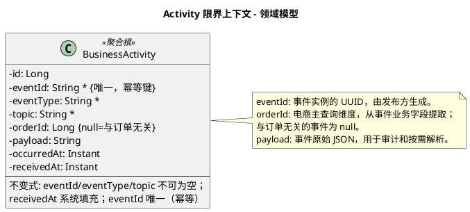

# Activity 限界上下文 - 领域模型

消费各 BC 的 Kafka 领域事件，构建业务活动记录，提供审计、统计、监控查询。

---

## 一、职责说明

Activity 是一个**只读聚合**服务：订阅 Order、Payment、Inventory 等 BC 发布的 Kafka 事件，将其持久化为统一的业务活动记录（BusinessActivity），对外提供查询 API。不发起任何写操作到上游 BC。

---

## 二、事件与业务活动的关系

- **领域事件（Event）**：各 BC 发布到 Kafka 的消息，携带 eventId（UUID）、eventType、occurredAt 及业务字段（如 orderId、paymentId 等）。
- **业务活动（BusinessActivity）**：Activity BC 消费事件后存的记录，是事件的**物化视图**，为查询和统计优化。一条事件 → 一条 BusinessActivity（1:1）。
- **幂等**：靠事件信封中的 **eventId**（UUID，全局唯一）判重；已处理过的 eventId 不再重复写入。
- **查询维度**：从事件的业务字段中提取 **orderId** 做列和索引（电商场景的主查询维度）；orderId 可空，与订单无关的事件（如 UserRegistered）为 null。

---

## 三、模型图（PlantUML）

修改模型时改此处即可；渲染见 [PlantUML](https://www.plantuml.com/plantuml) 或 IDE 插件。

---

## 四、聚合

### BusinessActivity（业务活动记录）

| 属性 | 类型 | 说明 |
|------|------|------|
| id | Long | 自增主键 |
| eventId | String | 事件实例的 UUID，由发布方生成；**唯一索引，用于幂等** |
| eventType | String | 事件类型，如 `OrderCreated`、`PaymentCompleted` |
| topic | String | Kafka topic，如 `order.created` |
| orderId | Long（可空） | 从事件业务字段提取的订单 ID；与订单无关的事件为 null |
| payload | String | 事件原始 JSON |
| occurredAt | Instant | 事件发生时间（来自事件载荷） |
| receivedAt | Instant | 服务接收时间 |

---

## 五、不变式

- `eventId`、`eventType`、`topic` 不可为空
- `eventId` 全局唯一（唯一索引）：已存在则跳过（幂等）
- `receivedAt` 由系统自动填充
- `orderId` 可空：与订单相关的事件有值（Order/Payment/Inventory/Fulfillment），与订单无关的事件为 null
