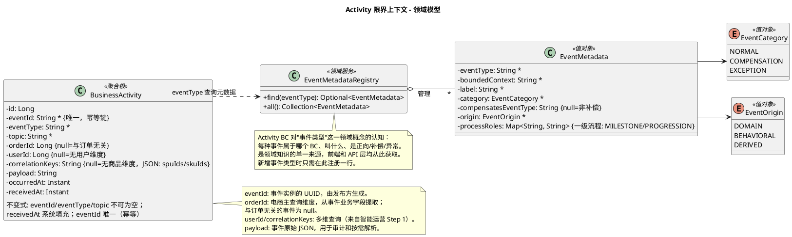

# Activity 限界上下文 - 领域模型

消费各 BC 的 Kafka 领域事件，构建业务活动记录，提供审计、统计、监控查询。

---

## 一、职责说明
 
Activity 是一个**只读聚合**服务：订阅 Order、Payment、Inventory 等 BC 发布的 Kafka 事件，将其持久化为统一的业务活动记录（BusinessActivity），对外提供查询 API。不发起任何写操作到上游 BC。

---

## 二、事件与业务活动的关系

- **领域事件（Event）**：各 BC 发布到 Kafka 的消息，携带 eventId（UUID）、eventType、occurredAt 及业务字段（如 orderId、paymentId 等）。
- **业务活动（BusinessActivity）**：Activity BC 消费事件后存的记录，是事件的**物化视图**，为查询和统计优化。一条事件 → 一条 BusinessActivity（1:1）。
- **幂等**：靠事件信封中的 **eventId**（UUID，全局唯一）判重；已处理过的 eventId 不再重复写入。
- **查询维度**：从事件的业务字段中提取 **orderId** 做列和索引（电商场景的主查询维度）；orderId 可空，与订单无关的事件（如 UserRegistered）为 null。来自业务需求 [智能运营 Step 1](../../business-requirements/intelligent-ops-step1/overview.md)：另提取 **userId**、**correlationKeys**（JSON，含 spuIds/skuIds）支持按用户、商品维度查询。

---

## 三、模型图（PlantUML）

修改模型时改此处即可；渲染见 [PlantUML](https://www.plantuml.com/plantuml) 或 IDE 插件。

---

## 四、领域概念

### 4.1 BusinessActivity（聚合根 — 业务活动记录）

| 属性 | 类型 | 说明 |
|------|------|------|
| id | Long | 自增主键 |
| eventId | String | 事件实例的 UUID，由发布方生成；**唯一索引，用于幂等** |
| eventType | String | 事件类型，如 `OrderCreated`、`PaymentCompleted` |
| topic | String | Kafka topic，如 `order.created` |
| orderId | Long（可空） | 从事件业务字段提取的订单 ID；与订单无关的事件为 null |
| userId | Long（可空） | 从事件 payload 的 userId 字段提取；无 userId 的事件（如 Inventory、Fulfillment）为 null（来自业务需求 [智能运营 Step 1](../../business-requirements/intelligent-ops-step1/overview.md)） |
| correlationKeys | String（可空） | 从事件 payload 的 items 提取的 spuId/skuId 集合，JSON 格式 `{"spuIds":[1,2],"skuIds":[10,20]}`；仅含 items 的事件才有值 |
| payload | String | 事件原始 JSON |
| occurredAt | Instant | 事件发生时间（来自事件载荷） |
| receivedAt | Instant | 服务接收时间 |

### 4.2 EventCategory（值对象 — 事件分类）

| 值 | 含义 |
|----|------|
| `NORMAL` | 正向事件（推动流程前进） |
| `COMPENSATION` | 补偿事件（Saga 回滚，撤销此前正向操作） |
| `EXCEPTION` | 异常事件（非补偿，可能触发补偿或重试） |

### 4.3 EventMetadata（值对象 — 事件元数据）

描述一种事件类型的业务语义。

| 属性 | 类型 | 说明 |
|------|------|------|
| eventType | String | 事件类型标识，如 `OrderCreated` |
| boundedContext | String | 所属限界上下文，如 `Order`、`Payment` |
| label | String | 中文显示标签，如"订单创建" |
| category | EventCategory | 事件分类 |
| compensatesEventType | String（可空） | 仅补偿事件有值，表示它补偿了哪个正向事件 |
| origin | EventOrigin | 事件来源类型：DOMAIN / BEHAVIORAL / DERIVED（来自 [智能运营 Step 1](../../business-requirements/intelligent-ops-step1/overview.md)） |
| processRoles | Map\<String, String\> | 事件在各一级业务流程中的角色，key=流程标识（如 trading、user_development），value=MILESTONE 或 PROGRESSION |

### 4.3.1 EventOrigin（值对象 — 事件来源）

| 值 | 含义 |
|----|------|
| `DOMAIN` | 领域事件（BC 状态变化产生） |
| `BEHAVIORAL` | 行为事件（用户操作产生，Step 2+ 预留） |
| `DERIVED` | 派生事件（由规则/模型推断，Step 3+ 预留） |

### 4.4 EventMetadataRegistry（领域服务 — 事件元数据注册表）

Activity BC 对"事件类型"这一领域概念的认知中心，集中管理所有已知事件类型的业务语义。是**领域知识的单一来源**——前端、API 层、统计服务均从此获取事件的分类、标签和补偿关系，任何消费方**不应**硬编码这些信息。

- `find(eventType)` → 查询单个事件类型的元数据
- `all()` → 返回所有已注册事件类型的元数据

新增事件类型时，在注册表中注册一行即可，API 响应和前端展示自动生效。

---

## 四-B、订单事实读模型（来自智能运营 Step 3）

来自业务需求 [智能运营 Step 3](../../business-requirements/intelligent-ops-step3/overview.md)。从 BusinessActivity 事件流投影而来的 CQRS 读模型，面向运营分析场景。

### OrderFact（值对象 — 订单事实）

以订单为中心的宽表视图，每个 orderId 一条记录。

| 属性 | 类型 | 说明 |
|------|------|------|
| orderId | Long | 订单 ID，主键 |
| userId | Long | 下单用户 ID |
| totalAmountCents | long | 订单总金额（分） |
| itemCount | int | 商品行数 |
| totalQuantity | int | 商品总数量 |
| hasEngraving | boolean | 是否含镭雕（由 EngravingCompleted 事件存在推导） |
| hasWarranty | boolean | 是否含保障服务（由 ServiceActivated 事件存在推导） |
| currentStage | String | 当前阶段：CREATED / PAID / FULFILLING / SHIPPED / DELIVERED / COMPLETED / CANCELLED |
| cancelReason | String（可空） | 取消原因：TIMEOUT（支付超时）/ MANUAL（手动取消） |
| isAbnormal | boolean | 是否异常（存在 PaymentFailed 或 PaymentExpired） |
| createdAt | Instant | 订单创建时间 |
| paidAt | Instant（可空） | 支付完成时间 |
| shippedAt | Instant（可空） | 发货时间 |
| deliveredAt | Instant（可空） | 签收时间 |
| completedAt | Instant（可空） | 订单完成时间 |
| cancelledAt | Instant（可空） | 取消时间 |
| paymentDurationSec | Long（可空） | 支付耗时（秒） |
| fulfillmentDurationSec | Long（可空） | 履约耗时（秒，paidAt → deliveredAt） |
| createdDate | LocalDate | 创建日期（按天分析维度） |
| createdHour | int | 创建小时（按时段分析维度） |
| seedBatch | String（可空） | 种子数据批次标记 |

### OrderItemFact（值对象 — 订单行项事实）

以商品行为中心的明细表，每个订单的每个 SKU 一条记录。

| 属性 | 类型 | 说明 |
|------|------|------|
| id | Long | 自增主键 |
| orderId | Long | 所属订单 ID |
| userId | Long | 下单用户 ID |
| skuId | Long | SKU ID |
| spuId | Long（可空） | SPU ID |
| quantity | int | 购买数量 |
| unitPriceCents | long | 单价（分） |
| lineTotalCents | long | 行小计（= quantity * unitPriceCents） |
| orderTotalAmountCents | long | 订单总金额（冗余，便于行级分析） |
| orderCurrentStage | String | 订单当前阶段（级联更新） |
| orderHasEngraving | boolean | 订单是否含镭雕（级联更新） |
| orderHasWarranty | boolean | 订单是否含保障服务（级联更新） |
| createdDate | LocalDate | 创建日期 |
| seedBatch | String（可空） | 种子数据批次标记 |

### OrderFactProjection（领域服务 — 订单事实投影）

将 BusinessActivity 事件流投影为 OrderFact + OrderItemFact。

| 方法 | 说明 |
|------|------|
| `projectOrder(orderId)` | 根据 orderId 的所有 BusinessActivity 事件重新计算并 upsert OrderFact + OrderItemFact |
| `rebuildAll()` | 全量重建：遍历所有 distinct orderId，逐个调用 projectOrder |

**阶段推导优先级**（高到低）：CANCELLED > COMPLETED > DELIVERED > SHIPPED > FULFILLING > PAID > CREATED

---

## 五、不变式

- `eventId`、`eventType`、`topic` 不可为空
- `eventId` 全局唯一（唯一索引）：已存在则跳过（幂等）
- `receivedAt` 由系统自动填充
- `orderId` 可空：与订单相关的事件有值（Order/Payment/Inventory/Fulfillment），与订单无关的事件为 null
- `userId` 可空：从 payload 的 userId 提取，无则 null
- `correlationKeys` 可空：从 payload 的 items 提取 spuIds/skuIds 的 JSON，无 items 则 null
