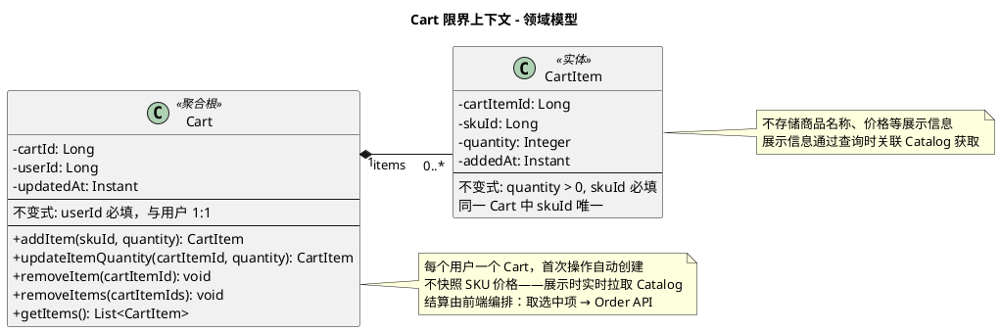

# Cart 限界上下文 - 领域模型

聚合、实体、值对象。需求见 [requirements.md](./requirements.md)。

---

## 一、职责说明

Cart 负责用户购物车管理，是「浏览商品」到「下单结算」之间的桥梁。用户可多次添加不同 SKU 到购物车，统一管理后勾选结算。

---

## 模型图（PlantUML）

---

## 实体与属性

### Cart — 聚合根

| 属性 | 类型 | 说明 |
|------|------|------|
| cartId | Long | 唯一标识 |
| userId | Long | 用户 ID，引用 User BC，唯一 |
| updatedAt | Instant | 最后更新时间 |

**不变式**：userId 必填；一个 userId 对应一个 Cart。

**领域行为**：
- `addItem(skuId, quantity)`：若该 skuId 已在购物车中，累加 quantity；否则新增 CartItem。quantity 必须 > 0
- `updateItemQuantity(cartItemId, quantity)`：更新指定项的数量；若 quantity = 0 则删除该项；quantity < 0 抛异常
- `removeItem(cartItemId)`：删除指定购物车项
- `removeItems(cartItemIds)`：批量删除（结算后清理）

### CartItem — 实体

| 属性 | 类型 | 说明 |
|------|------|------|
| cartItemId | Long | 唯一标识 |
| skuId | Long | SKU ID，引用 Catalog |
| quantity | Integer | 数量，> 0 |
| addedAt | Instant | 添加时间 |

**不变式**：quantity > 0；skuId 必填；同一 Cart 中 skuId 唯一。

---

## 与外部 BC 的依赖

| 依赖 BC | 方向 | 使用方式 | 说明 |
|---------|------|----------|------|
| User | Cart → User | userId | 购物车按用户隔离 |
| Catalog | Cart → Catalog | REST 同步 | 添加时校验 SKU 存在性；查询时拉取展示信息（名称、价格、图片） |
| Order | Cart → Order | 前端编排 | 结算时前端从 Cart 取选中项，调用 Order API 创建订单 |

---

## 领域事件

Cart 当前**不发布跨 BC 领域事件**。购物车变更不影响其他 BC 业务流程。未来如需审计（如「加购行为分析」）可按需补充。

---

## 聚合边界

- **Cart** 为聚合根，包含 CartItem 列表。对购物车的所有操作（添加、修改、删除）都通过 Cart 聚合根进行，保证同一用户购物车的一致性。
- Cart 与 CartItem 在同一事务中操作。

---

## 实体与表

| 模型 | 表名 |
|------|------|
| Cart | cart |
| CartItem | cart_item |
