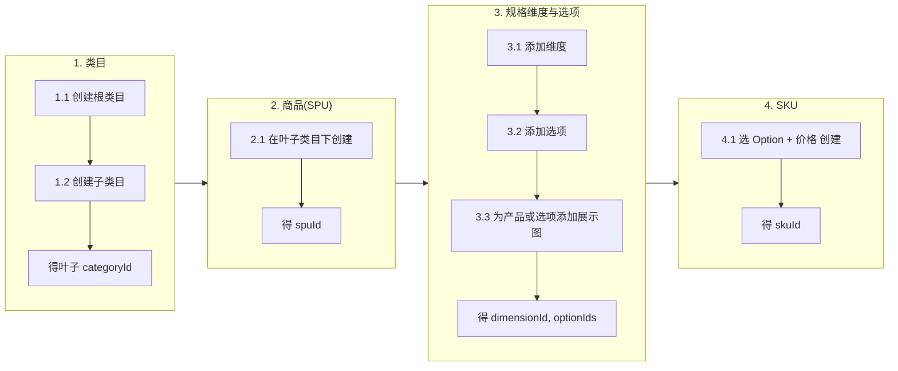

# 商品限定上下文 - 需求列表

每个功能对应一个 .feature 文件，场景对应 Gherkin Scenario。契约：`docs/bounded-contexts/catalog/api.yaml`。Feature 目录：`services/catalog-service/src/test/resources/features/catalog/`。

### 状态图例

- ✅ 已实现（后端 + 测试 + 契约均已完成）
- 🔄 变更已有需求（已有实现需修改，待重新实现）
- 🔲 待实现（全新需求）

### 主路径示意（操作顺序）

顺序：类目 → SPU → 维度与选项（含展示图） → SKU；上一步产出的 ID 为下一步输入。

---

## 1. 管理类目  
`category.feature`

- ✅ 1.1 创建根级类目时应成功并返回名称且无父类目
- ✅ 1.2 在已有类目下创建子类目时应成功并返回名称及父类目
- ✅ 1.3 请求根下所有类目时应返回类目列表
- ✅ 1.4 请求某类目下子类目时应返回子类目列表
- ✅ 1.5 父类目不存在时创建子类目应失败并返回 404
- ✅ 1.6 修改已有类目时应成功并返回新名称与描述
- ✅ 1.7 删除已有类目后该类目不再存在
- ✅ 1.8 类目不存在时修改应返回 404
- ✅ 1.9 类目不存在时删除应返回 404
- ✅ 1.10 查询完整类目树时应返回所有层级类目（根→子→叶子），每个节点包含 id、name、description 及 children

---

## 2. 管理商品  
`product.feature`

- ✅ 2.1 在叶子类目下创建商品时应成功并返回商品信息
- ✅ 2.2 在非叶子类目下创建商品时应失败并返回错误提示
- ✅ 2.3 按类目请求该类目下商品时应返回商品列表
- ✅ 2.4 按 ID 请求商品详情时应返回商品信息
- ✅ 2.5 删除已存在的商品时应成功且再次查询返回 404；删除不存在的商品时应返回 404
- ✅ 2.6 类目不存在时创建商品应失败并返回 404
- ✅ 2.7 请求不存在的商品详情时应返回 404
- ✅ 2.8 修改已有商品的名称和描述时应成功并返回新信息
- ✅ 2.9 商品不存在时修改应返回 404
- ✅ 2.10 按类目或按 ID 返回商品时，响应包含默认展示图
- ✅ 2.11 按关键词搜索商品时应返回名称匹配的商品列表（跨类目），支持模糊匹配；关键词为空时返回全部商品：`coverImageUrl`（首图 URL，无图时为 null）、`defaultDisplayImages`（图列表）；规则为有产品级图则用产品级图，否则用第一个「有图」的规格选项的图；无任何图时两者均为空

---

## 3. 管理 SPU 规格维度与选项  
`spec-dimension.feature`

先为 SPU 配置维度（如容量、颜色）及每维度下的可选项（如 128G/256G、黑/白），后续创建 SKU 时从各维度选一 Option 组合。产品可拥有多张展示图（ProductImage）：展示图可挂在**产品本身**（不关联任何选项），也可挂在**某规格选项**下；不再要求维度标记为「影响外观」，任意选项或产品本身均可挂图。

- ✅ 3.1 为 SPU 添加规格维度时应成功并返回维度名称
- ✅ 3.2 为维度添加可选项时应成功并返回选项值
- ✅ 3.3 请求某 SPU 下维度及选项时应返回维度列表、选项及展示图列表（含产品级展示图的可查询性）
- ✅ 3.4 SPU 不存在时添加维度应失败并返回 404
- ✅ 3.5 同 SPU 内维度名称重复时添加维度应失败并返回错误提示
- ✅ 3.6 同维度内选项值重复时添加选项应失败并返回错误提示
- ✅ 3.7 维度不存在时添加选项应失败并返回 404
- 🔄 3.8 为某选项添加展示图时应成功并返回展示图信息（不再限制该维度是否影响外观）— 待实现
- 🔲 3.9 为产品添加展示图（不指定选项）时应成功并返回展示图信息 — 待实现
- ✅ 3.10 请求某选项下展示图列表时应返回按排序排列的展示图
- 🔲 3.11 请求某 SPU 的产品级展示图列表时应返回按排序排列的展示图 — 待实现
- ✅ 3.12 删除已有展示图后该展示图不再存在
- ✅ 3.13 选项不存在时添加展示图应失败并返回 404
- ✅ 3.14 删除不存在的展示图时应返回 404

（原 3.11「为非影响外观维度的选项添加展示图应失败」已移除：不再有此业务限制。）

**与本次变更相关的 feature 修改**：维度上的「是否影响外观」（`affectsAppearance`）已从领域模型与实现中移除，API、实体表与 feature 均不包含该字段。

---

## 4. 管理 SKU  
`sku.feature`

SKU = 每个必填维度选一 Option + 价格（分）。规格展示名可自动生成或可选。服务类 SPU 的 SKU 可不关联规格选项（无规格维度时直接以价格创建）。

- ✅ 4.1 在 SPU 下选齐必填 Option 及价格创建 SKU 时应成功并返回 SKU 信息
- ✅ 4.2 SPU 不存在时创建 SKU 应失败并返回 404
- ✅ 4.3 未选齐必填维度时创建 SKU 应失败并返回错误提示
- ✅ 4.4 按 SPU 请求该 SPU 下 SKU 时应返回 SKU 列表
- ✅ 4.5 按 SPU 与 SKU ID 请求详情时应返回 SKU 信息
- ✅ 4.6 传入不属于该 SPU 的 Option 时创建 SKU 应失败并返回错误提示
- ✅ 4.7 价格为负数时创建 SKU 应失败并返回错误提示
- ✅ 4.8 请求不存在的 SKU 详情时应返回 404
- ✅ 4.9 修改已有 SKU 的价格时应成功并返回新价格
- ✅ 4.10 删除已有 SKU 后该 SKU 不再存在
- ✅ 4.11 SKU 不存在时修改应返回 404
- ✅ 4.12 SKU 不存在时删除应返回 404

---

## 5. 管理商品类型与服务绑定  
`service-binding.feature`

> 以下变更来自业务需求 [虚拟商品](../../business-requirements/virtual-product/overview.md)

SPU 新增商品类型（实体 / 服务）。服务类 SPU 的期限通过 SpecDimension + SpecOption 表达（如"服务期限"维度，"一年"/"两年"选项），与实体商品规格统一。服务 SKU 通过 ServiceBinding 与实体 SPU 建立上下文定价关系：同一服务 SKU 保护不同实体商品时价格不同。

- ✅ 5.1 创建 SPU 时可指定 productType（PHYSICAL / SERVICE），不指定时默认 PHYSICAL；返回应包含 productType
- ✅ 5.2 创建 SERVICE 类型 SPU；服务期限通过 SpecDimension + SpecOption 表达
- ✅ 5.3 为服务 SKU 添加 ServiceBinding（关联到目标实体 SPU + 可选售价）时应成功；priceCents 可为 null（继承 SKU 标准价）或指定值（上下文定价）
- ✅ 5.4 目标 SPU 不存在时添加 ServiceBinding 应返回 404
- ✅ 5.5 服务 SKU 不存在时添加 ServiceBinding 应返回 404
- ✅ 5.6 对 PHYSICAL 类型 SPU 的 SKU 添加 ServiceBinding 应失败并返回错误（仅 SERVICE SKU 可绑定）
- ✅ 5.7 查询某实体 SPU 的可选服务列表时应返回所有已绑定的服务 SKU（按 SPU 分组，含名称、规格值、ServiceBinding 售价）
- ✅ 5.8 删除 ServiceBinding 时应成功
- ✅ 5.9 按 ID 查询 SPU 详情时，响应应包含 productType（兼容已有 2.4）
- ✅ 5.10 按类目或搜索返回商品列表时，响应应包含 productType（兼容已有 2.3、2.11）
- ✅ 5.11 为服务 SKU 添加 ServiceBinding 时不指定售价（priceCents=null），应成功并继承 SKU 标准价
- ✅ 5.12 查询可选服务列表时，binding 未指定售价的服务应返回 SKU 标准价作为最终售价

---

## 功能与 feature 对应

| 功能 | .feature 文件 | 场景数 | 状态 |
|------|----------------|--------|------|
| 1. 管理类目 | category.feature | 1.1～1.10 | ✅ 全部已实现 |
| 2. 管理商品 | product.feature | 2.1～2.11 | ✅ 全部已实现（响应已包含 productType） |
| 3. 管理 SPU 规格维度与选项 | spec-dimension.feature | 3.1～3.14 | 🔄 变更已有需求（展示图可挂产品本身，不再强制关联影响外观的选项） |
| 4. 管理 SKU | sku.feature | 4.1～4.12 | ✅ 全部已实现 |
| 5. 管理商品类型与服务绑定 | service-binding.feature | 5.1～5.12 | ✅ 全部已实现 |
