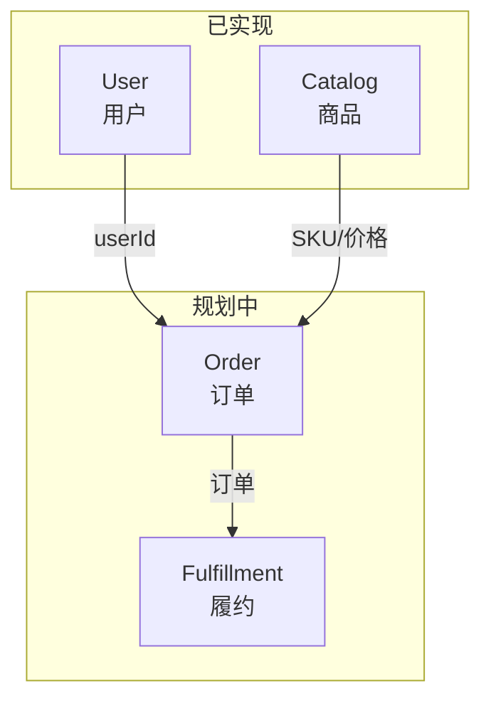

# HMall 上下文地图（Context Map）

描述各限界上下文及其之间的关系。上下游关系与集成方式会随实现演进更新。

---

## 上下文概览



---

## 上下文说明

| 上下文 | 职责 | 状态 |
|--------|------|------|
| **Catalog** | 类目、商品(SPU)、规格维度、SKU | 已实现 |
| **User** | 用户身份、地址簿（未来） | 已实现（骨架） |
| **Order** | 订单创建、状态流转 | 规划中 |
| **Fulfillment** | 履约、发货 | 规划中 |

---

## 集成关系

| 上游 | 下游 | 集成方式 | 说明 |
|------|------|----------|------|
| Catalog | Order | REST API / 本地调用 | Order 创建时按 skuId 拉取 SKU 与价格 |
| User | Order | REST API / 本地调用 | Order 可选引用 userId；用户地址用于收货 |
| Order | Fulfillment | 事件 / API | 待定义 |

---

## 文档位置

各上下文的领域模型、需求、API 契约位于其目录下：

```
docs/bounded-contexts/
├── context-map.md      # 本文件
├── catalog/
│   ├── domain-model.md
│   ├── requirements.md
│   ├── api.yaml
│   └── process/
├── user/
│   ├── domain-model.md
│   ├── requirements.md
│   ├── api.yaml
│   └── process/
└── ...
```
