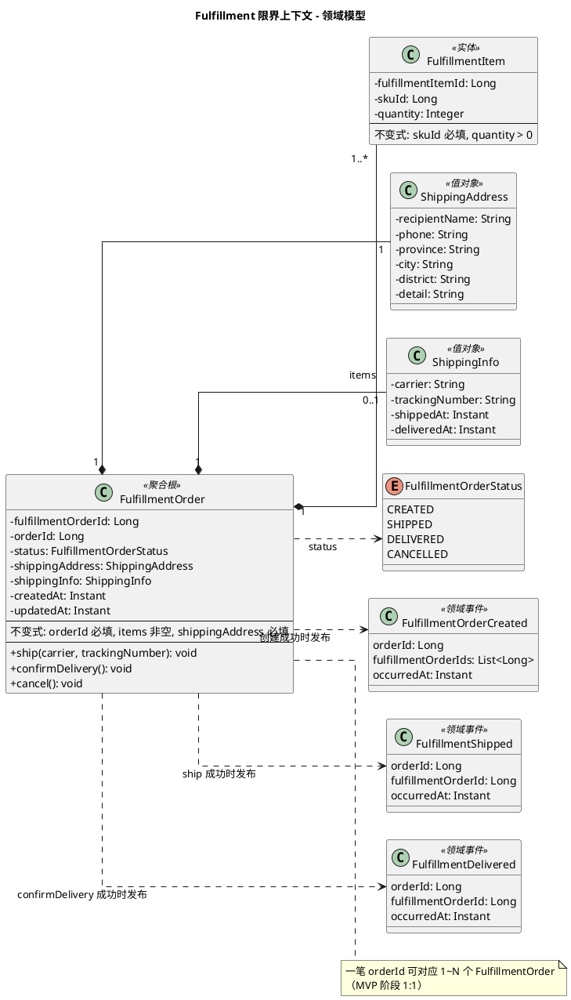
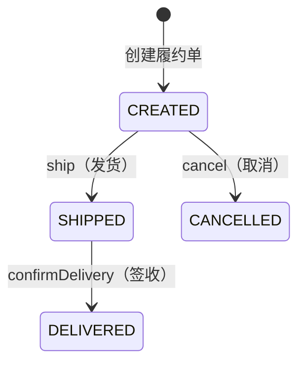

# Fulfillment 限界上下文 - 领域模型

聚合、实体、值对象、领域事件。事件流转与集成方式见 [event-flow.md](./event-flow.md)，需求列表见 [requirements.md](./requirements.md)。

---

## 一、职责说明

Fulfillment 负责订单的履约执行：接收 Order 的创建请求后，按业务规则拆单（MVP 阶段 1:1），管理每个履约单从 CREATED → SHIPPED → DELIVERED 的生命周期，通过 Kafka 事件通知 Order 推进状态。

---

## 二、模型图（PlantUML）

---

## 三、实体与属性

### FulfillmentOrder — 聚合根

| 属性 | 类型 | 说明 |
|------|------|------|
| fulfillmentOrderId | Long | 唯一标识 |
| orderId | Long | 关联的订单 ID，引用 Order BC |
| status | FulfillmentOrderStatus | 履约单状态 |
| items | List\<FulfillmentItem\> | 履约商品明细 |
| shippingAddress | ShippingAddress | 配送地址（创建时从 Order 快照） |
| shippingInfo | ShippingInfo | 物流信息（发货后填充） |
| createdAt | Instant | 创建时间 |
| updatedAt | Instant | 更新时间 |

**FulfillmentOrderStatus**：CREATED | SHIPPED | DELIVERED | CANCELLED

**不变式**：orderId 必填；items 非空且每项 quantity > 0；shippingAddress 必填。

**领域行为**：
- `ship(carrier, trackingNumber)`：仅 CREATED → SHIPPED，填充 shippingInfo
- `confirmDelivery()`：仅 SHIPPED → DELIVERED，记录 deliveredAt
- `cancel()`：仅 CREATED → CANCELLED（已发货不可取消）

### FulfillmentItem — 实体

| 属性 | 类型 | 说明 |
|------|------|------|
| fulfillmentItemId | Long | 唯一标识 |
| skuId | Long | SKU ID，引用 Catalog |
| quantity | Integer | 数量，> 0 |

**不变式**：skuId 必填；quantity > 0。

### ShippingAddress — 值对象

创建履约单时由 Order 传入的配送地址快照。履约单创建后地址不再变更。

| 属性 | 类型 | 说明 |
|------|------|------|
| recipientName | String | 收件人 |
| phone | String | 电话 |
| province | String | 省 |
| city | String | 市 |
| district | String | 区 |
| detail | String | 详细地址 |

**不变式**：收件人、电话、省市区、详细地址必填。

### ShippingInfo — 值对象

物流信息，发货时填充。

| 属性 | 类型 | 说明 |
|------|------|------|
| carrier | String | 承运商（如"顺丰"、"中通"） |
| trackingNumber | String | 物流单号 |
| shippedAt | Instant | 发货时间 |
| deliveredAt | Instant | 签收时间（签收后填充） |

---

## 四、状态流转

| 转换 | 前置条件 | 动作 |
|------|----------|------|
| → CREATED | Order 同步调用创建 | 保存履约单，发布 FulfillmentOrderCreated |
| CREATED → SHIPPED | 提供 carrier + trackingNumber | 填充 shippingInfo，发布 FulfillmentShipped |
| SHIPPED → DELIVERED | 物流签收确认 | 记录 deliveredAt，发布 FulfillmentDelivered |
| CREATED → CANCELLED | Order 补偿调用 | 标记取消，不发布事件 |

---

## 五、领域事件

| 事件 | 时机 | 载荷 |
|------|------|------|
| FulfillmentOrderCreated（履约单已创建） | 创建履约单成功 | orderId, fulfillmentOrderIds, occurredAt |
| FulfillmentShipped（已发货） | ship 成功 | orderId, fulfillmentOrderId, occurredAt |
| FulfillmentDelivered（已签收） | confirmDelivery 成功 | orderId, fulfillmentOrderId, occurredAt |

事件的订阅方、Topic、传输通道、JSON 消息体等集成细节见 [event-flow.md](./event-flow.md)。

---

## 六、聚合边界

- **FulfillmentOrder** 为聚合根，FulfillmentItem 和 ShippingInfo 为其内部对象。
- 同一 orderId 可对应多个 FulfillmentOrder（1:N 拆单），但每个 FulfillmentOrder 独立管理生命周期。
- 创建时的幂等键为 orderId：同一 orderId 重复调用返回已有结果。

---

## 七、实体与表

| 模型 | 表名 |
|------|------|
| FulfillmentOrder | fulfillment_order |
| FulfillmentItem | fulfillment_item |

ShippingAddress 和 ShippingInfo 为值对象，均嵌入 fulfillment_order 表（recipient_name、phone、province、city、district、detail、carrier、tracking_number、shipped_at、delivered_at 列）。
