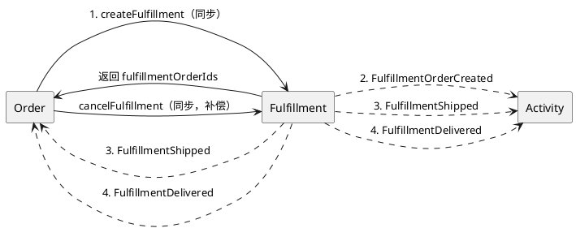

# Fulfillment 限界上下文 - 事件流

集成方式、事件契约、API 契约。领域结构见 [domain-model.md](./domain-model.md)，需求列表见 [requirements.md](./requirements.md)。

---

## 一、参与方

| BC | 关系 | 集成方式 |
|----|------|----------|
| Order | 上游：调用创建/取消履约单 | **同步调用**（REST） |
| Fulfillment | 当前 BC | — |
| Order | 下游：订阅 Shipped / Delivered | **Kafka 事件** |
| Activity | 下游：订阅全部事件 | **Kafka 事件** |

---

## 二、流程

### 主流程

```
Order 同步调用 createFulfillment(orderId, items, shippingAddress)
  → Fulfillment 拆单、创建 FulfillmentOrder（MVP: 1:1）
  → 返回 fulfillmentOrderIds（Order 当场置 FULFILLING）
  → 发布 FulfillmentOrderCreated 事件（Activity 消费）

管理后台/内部操作：发货
  → FulfillmentOrder 状态 CREATED → SHIPPED
  → 发布 FulfillmentShipped 事件（Order + Activity 消费）

物流签收确认
  → FulfillmentOrder 状态 SHIPPED → DELIVERED
  → 发布 FulfillmentDelivered 事件（Order + Activity 消费）
```

### 取消（补偿路径）

```
Order 同步调用 cancelFulfillment(orderId)
  → Fulfillment 取消该 orderId 下所有 CREATED 状态的履约单
  → 已 SHIPPED / DELIVERED 的履约单不受影响（不可取消）
```

### 流程图



---

## 三、同步调用契约（REST API）

### 创建履约单

```
POST /api/fulfillment/create
```

请求体：

```json
{
  "orderId": 12345,
  "items": [
    { "skuId": 101, "quantity": 2 },
    { "skuId": 202, "quantity": 1 }
  ],
  "shippingAddress": {
    "recipientName": "何勉",
    "phone": "13641793760",
    "province": "上海",
    "city": "上海",
    "district": "浦东新区",
    "detail": "羽山路100弄9号2902"
  }
}
```

成功响应（200）：

```json
{
  "orderId": 12345,
  "fulfillmentOrderIds": [1001]
}
```

| 场景 | 状态码 | 说明 |
|------|--------|------|
| 创建成功 | 200 | 返回 fulfillmentOrderIds |
| 幂等：orderId 已存在 | 200 | 返回已有 fulfillmentOrderIds |
| 缺失 orderId、items 为空或 shippingAddress 缺失 | 400 | 参数校验失败 |

### 取消履约单

```
POST /api/fulfillment/cancel
```

请求体：

```json
{
  "orderId": 12345
}
```

成功响应（200）：

```json
{
  "orderId": 12345,
  "cancelledCount": 1
}
```

| 场景 | 状态码 | 说明 |
|------|--------|------|
| 取消成功 | 200 | 返回取消的履约单数量 |
| 无可取消的履约单 | 200 | cancelledCount = 0（幂等） |
| 缺失 orderId | 400 | 参数校验失败 |

### 发货

```
POST /api/fulfillment/{fulfillmentOrderId}/ship
```

请求体：

```json
{
  "carrier": "顺丰",
  "trackingNumber": "SF1234567890"
}
```

| 场景 | 状态码 | 说明 |
|------|--------|------|
| 发货成功 | 200 | 状态 → SHIPPED |
| 非 CREATED 状态 | 400 | 状态不允许发货 |
| 履约单不存在 | 404 | — |

### 签收确认

```
POST /api/fulfillment/{fulfillmentOrderId}/deliver
```

| 场景 | 状态码 | 说明 |
|------|--------|------|
| 签收成功 | 200 | 状态 → DELIVERED |
| 非 SHIPPED 状态 | 400 | 状态不允许签收 |
| 履约单不存在 | 404 | — |

### 查询

```
GET /api/fulfillment/{fulfillmentOrderId}
GET /api/fulfillment?orderId={orderId}
```

---

## 四、事件契约

### Fulfillment 发布

| 事件 | 时机 | Topic | 订阅方 | 关键 Payload |
|------|------|-------|--------|-------------|
| FulfillmentOrderCreated | 创建履约单成功 | `fulfillment.order.created` | Activity | orderId, fulfillmentOrderIds, occurredAt |
| FulfillmentShipped | 发货成功 | `fulfillment.shipped` | Order, Activity | orderId, fulfillmentOrderId, occurredAt |
| FulfillmentDelivered | 签收确认 | `fulfillment.delivered` | Order, Activity | orderId, fulfillmentOrderId, occurredAt |

**注意**：FulfillmentOrderCreated 事件仅 Activity 消费（审计/统计），Order 通过同步调用返回值获取结果，不再消费此事件。

### 事件消息体

**FulfillmentOrderCreated**：

```json
{
  "eventType": "FulfillmentOrderCreated",
  "eventId": "uuid",
  "orderId": 12345,
  "fulfillmentOrderIds": [1001],
  "occurredAt": "2026-02-20T10:00:00Z"
}
```

**FulfillmentShipped**：

```json
{
  "eventType": "FulfillmentShipped",
  "eventId": "uuid",
  "orderId": 12345,
  "fulfillmentOrderId": 1001,
  "occurredAt": "2026-02-20T12:00:00Z"
}
```

**FulfillmentDelivered**：

```json
{
  "eventType": "FulfillmentDelivered",
  "eventId": "uuid",
  "orderId": 12345,
  "fulfillmentOrderId": 1001,
  "occurredAt": "2026-02-20T14:00:00Z"
}
```

### 事件通用约定

| 约定 | 说明 |
|------|------|
| 关联键 | orderId |
| 幂等键 | eventId（UUID），Fulfillment 生成 |
| 消息格式 | JSON |
| 传输 | Kafka；Topic 命名 `fulfillment.<event-type>` |
| 消费语义 | at-least-once，消费方保证幂等 |
