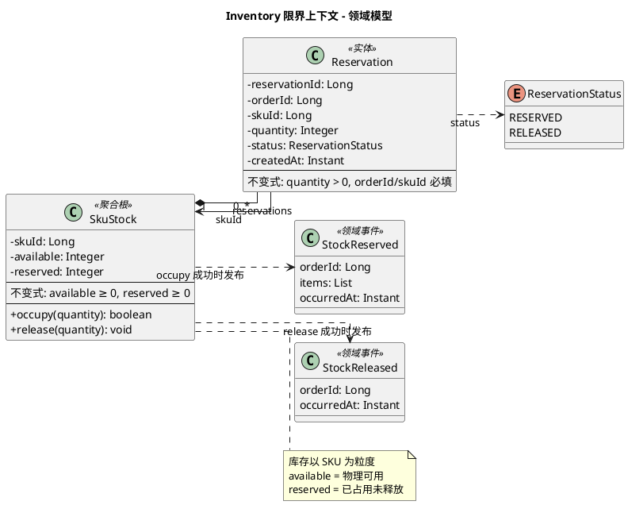

# Inventory 限界上下文 - 领域模型

聚合、实体、值对象。集成与调用契约见 [event-flow.md](./event-flow.md)。

---

## 一、职责说明

Inventory 提供**同步的库存占用**与**释放**能力：Order 创建订单时同步占用库存，取消时同步释放，用户可立即获得库存反馈。

---

## 模型图（PlantUML）

---

## 实体与属性

### SkuStock — 聚合根

| 属性 | 类型 | 说明 |
|------|------|------|
| skuId | Long | SKU ID，引用 Catalog，唯一 |
| available | Integer | 可用数量，≥0 |
| reserved | Integer | 已占用数量，≥0 |

**不变式**：available ≥ 0，reserved ≥ 0。占用时从 available 减、reserved 增；释放时 reserved 减、available 增。

**领域行为**：
- `occupy(quantity)`：若 available ≥ quantity，则 available -= quantity, reserved += quantity，返回 true；否则返回 false
- `release(quantity)`：reserved -= quantity, available += quantity（调用方保证 quantity 不超过当前 reserved）
- `setAvailable(quantity)`：管理后台初始化/更新可用数量，quantity ≥ 0（仅改 available，reserved 不变）

### Reservation — 实体

| 属性 | 类型 | 说明 |
|------|------|------|
| reservationId | Long | 唯一标识 |
| orderId | Long | 订单 ID，引用 Order |
| skuId | Long | SKU ID |
| quantity | Integer | 占用数量，>0 |
| status | ReservationStatus | RESERVED \| RELEASED |
| createdAt | Instant | 创建时间 |

**不变式**：quantity > 0；orderId、skuId 必填。

**用途**：记录占用关系，用于释放时按 orderId 查找并执行 release。

### ReservationStatus — 枚举

占用记录的状态：**RESERVED**（已占用）、**RELEASED**（已释放）。创建占用时为 RESERVED，释放后置为 RELEASED。

---

## 领域事件

| 事件 | 时机 | 载荷 |
|------|------|------|
| StockReserved（库存已占用） | occupy 成功 | orderId, items: [{ skuId, quantity }], occurredAt |
| StockReleased（库存已释放） | release 成功 | orderId, occurredAt |

---

## 聚合边界

- **SkuStock** 为聚合根，保证同一 skuId 的库存更新在单事务内完成，避免超卖。
- **Reservation** 独立表，与 SkuStock 在应用层协调：占用时先更新 SkuStock，再创建 Reservation；释放时先按 orderId 查 Reservation，再更新 SkuStock 并标记 Reservation 为 RELEASED。

---

## 实体与表

| 模型 | 表名 |
|------|------|
| SkuStock | sku_stock |
| Reservation | reservation |
