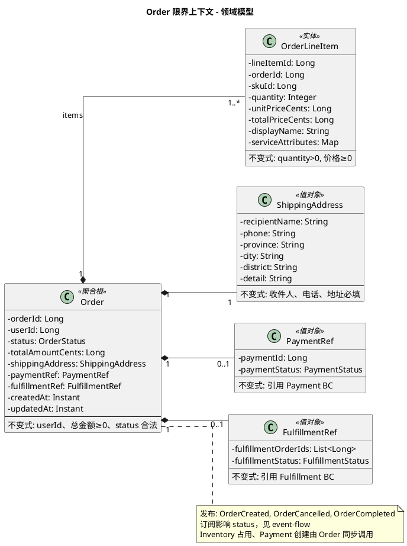

# Order 限界上下文 - 领域模型

聚合、实体、状态。流程与事件契约见 [event-flow.md](./event-flow.md)。

---

## 模型图（PlantUML）

---

## 实体与属性

### Order — 聚合根

| 属性 | 类型 | 说明 |
|------|------|------|
| orderId | Long | 唯一标识 |
| userId | Long | 用户 ID，引用 User BC |
| status | OrderStatus | 订单状态 |
| totalAmountCents | Long | 总金额（分），≥0 |
| shippingAddress | ShippingAddress | 收货地址 |
| paymentRef | PaymentRef | 支付引用（可选） |
| fulfillmentRef | FulfillmentRef | 履约引用（可选） |
| createdAt | Instant | 创建时间 |
| updatedAt | Instant | 更新时间 |

**OrderStatus**：PENDING_PAYMENT | PAID | FULFILLING | SHIPPED | DELIVERED | COMPLETED | CANCELLED

**不变式**：userId、totalAmountCents≥0 必填；status 合法流转。

### OrderLineItem — 实体

| 属性 | 类型 | 说明 |
|------|------|------|
| lineItemId | Long | 唯一标识 |
| orderId | Long | 所属订单 |
| skuId | Long | SKU ID，引用 Catalog |
| quantity | Integer | 数量，>0 |
| unitPriceCents | Long | 单价（分），快照 |
| totalPriceCents | Long | 小计（分） |
| displayName | String | 商品展示名，快照 |
| serviceAttributes | Map | 增值服务（如 engravingText） |

**不变式**：quantity>0；unitPriceCents、totalPriceCents≥0。

### ShippingAddress — 值对象

| 属性 | 类型 | 说明 |
|------|------|------|
| recipientName | String | 收件人 |
| phone | String | 电话 |
| province | String | 省 |
| city | String | 市 |
| district | String | 区 |
| detail | String | 详细地址 |

**不变式**：收件人、电话、省市区、详细地址必填。

### PaymentRef — 值对象

| 属性 | 类型 | 说明 |
|------|------|------|
| paymentId | Long | 支付单 ID，引用 Payment BC |
| paymentStatus | PaymentStatus | PENDING \| COMPLETED \| FAILED \| REFUNDED |

### FulfillmentRef — 值对象

| 属性 | 类型 | 说明 |
|------|------|------|
| fulfillmentOrderIds | List\<Long\> | 履约单 ID 列表 |
| fulfillmentStatus | FulfillmentStatus | PENDING \| CREATED \| SHIPPED \| DELIVERED |

---

## 事件与状态

Order 发布：OrderCreated, OrderCancelled, OrderCompleted（定义见 [event-flow.md](./event-flow.md)）。

订阅事件 → status 映射：

| 触发 | status | 说明 |
|------|--------|------|
| PlaceOrder 成功（含同步库存占用） | PENDING_PAYMENT | — |
| PaymentFailed | 保持 PENDING_PAYMENT | 用户可重试支付 |
| PaymentExpired | CANCELLED | 触发补偿（释放库存） |
| PaymentCompleted + 同步创建履约单 | PAID | 同步调用 Fulfillment，**保持 PAID**（不推进 FULFILLING） |
| FulfillmentOrderAllocated | FULFILLING | 履约开始配货，订单页可显示「正在配货」 |
| FulfillmentShipped | SHIPPED | 全部履约单发货才推进（1:N 时） |
| FulfillmentDelivered | DELIVERED | 全部签收才推进，发布 OrderCompleted |
| 用户取消（PENDING_PAYMENT / PAID / FULFILLING） | CANCELLED | SHIPPED 及之后不可取消；PAID/FULFILLING 时需调用 cancelFulfillment |

---

## 实体与表

| 模型 | 表名 |
|------|------|
| Order | orders |
| OrderLineItem | order_line_item |

ShippingAddress、PaymentRef、FulfillmentRef 为值对象，可嵌入 orders 或单独表按实现选择。
