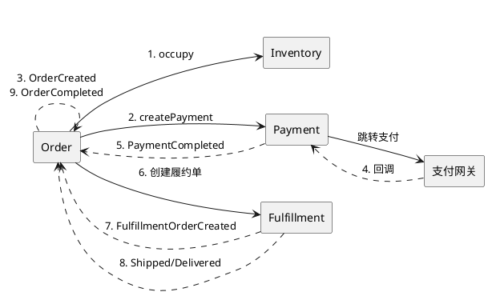
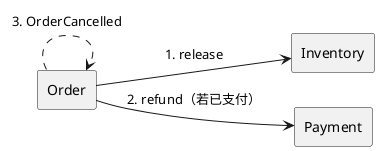

# Order 限界上下文 - 事件流

流程、事件契约、BC 间编排。领域结构见 [domain-model.md](./domain-model.md)，Saga 设计见 [saga-design.md](./saga-design.md)。

---

## 一、参与方

| BC | 关系 |
|----|------|
| Catalog | 上游：SKU、价格 |
| User | 上游：userId、收货地址 |
| Order | 编排中心 |
| Inventory | 下游：**同步**占用/释放库存（Order 直接调用） |
| Payment | 下游：**同步调用**发起支付、退款；支付结果由 Payment 通过 **Kafka 事件**通知（PaymentCompleted/Failed/Expired），Order 通过 KafkaPaymentEventConsumer 消费 |
| Fulfillment | 下游：拆单、发货、配送 |
| Pricing | 下游：算价（同步调用） |

---

## 二、主流程

PlaceOrder →（同步调用 Inventory 占用，成功则）OrderCreated → PaymentCompleted → FulfillmentOrderCreated → FulfillmentShipped → FulfillmentDelivered → OrderCompleted

- **PlaceOrder**：保存订单后**同步调用** Inventory 占用；若库存不足则失败返回，订单不落库或回滚
- **失败分支**：PaymentFailed → 不影响订单（保持待支付，用户可重试）；PaymentExpired → 触发补偿（含释放库存、取消订单）
- **取消**：Order 取消时**同步调用** Inventory 释放

### 流程图

BC 为节点；实线 = 同步调用，虚线 = 事件。

**下单与支付**

*PlantUML*

**取消订单**

*PlantUML*

---

## 三、事件契约

### Order 发布

| 事件 | 时机 |
|------|------|
| OrderCreated | 订单创建成功且库存占用成功 |
| OrderCancelled | 订单取消 |
| OrderCompleted | 配送完成 |

### Kafka 发布

Order 发布的三个事件直接发送至 Kafka，供其他应用（如 Inventory、报表、审计等）订阅。不使用 Spring 进程内事件，跨 BC 通信统一走 Kafka。

| Topic | 事件 | 消息体（JSON） |
|-------|------|----------------|
| `order.created` | OrderCreated | eventType, orderId, items: [{ skuId, quantity }], occurredAt |
| `order.cancelled` | OrderCancelled | eventType, orderId, occurredAt |
| `order.completed` | OrderCompleted | eventType, orderId, occurredAt |

配置：`application.yml` 中 `spring.kafka.bootstrap-servers`、`order.kafka.topic.*`。运行前需启动 Kafka（如 `docker compose -f infra/docker-compose.yml up -d`）。Kafka 默认启用，测试中排除 `KafkaAutoConfiguration`。

### Kafka 消费（Payment 事件）

Order 通过 `KafkaPaymentEventConsumer` 消费 Payment 的三个事件 topic，调用 `OrderEventService` 处理。由 `OrderKafkaAutoConfiguration`（`@AutoConfiguration(after = KafkaAutoConfiguration.class)`）条件注册。

| Topic | 事件 | Order 处理方法 |
|-------|------|----------------|
| `payment.completed` | PaymentCompleted | `orderEventService.onPaymentCompleted(orderId, paymentId)` |
| `payment.failed` | PaymentFailed | `orderEventService.onPaymentFailed(orderId)` |
| `payment.expired` | PaymentExpired | `orderEventService.onPaymentExpired(orderId)` |

### Kafka 消费（Fulfillment 事件）

Order 通过 `KafkaFulfillmentEventConsumer` 消费 Fulfillment 的三个事件 topic，调用 `OrderEventService` 处理。同样由 `OrderKafkaAutoConfiguration` 条件注册。

| Topic | 事件 | Order 处理方法 |
|-------|------|----------------|
| `fulfillment.order.created` | FulfillmentOrderCreated | `orderEventService.onFulfillmentOrderCreated(orderId, fulfillmentOrderIds)` |
| `fulfillment.shipped` | FulfillmentShipped | `orderEventService.onFulfillmentShipped(orderId)` |
| `fulfillment.delivered` | FulfillmentDelivered | `orderEventService.onFulfillmentDelivered(orderId)` |

### Order 订阅

| 事件 | 来源 | 传输方式 | 载荷 | Order 反应 |
|------|------|----------|------|------------|
| PaymentCompleted | Payment | Kafka（`payment.completed`） | orderId, paymentId | 置 PAID、创建履约单 |
| PaymentFailed | Payment | Kafka（`payment.failed`） | orderId | 不做状态变更，保持 PENDING_PAYMENT（用户可重试支付） |
| PaymentExpired | Payment | Kafka（`payment.expired`） | orderId | 取消、补偿（含释放库存） |
| FulfillmentOrderCreated | Fulfillment | Kafka（`fulfillment.order.created`） | orderId, fulfillmentOrderIds | 更新 fulfillmentRef、置 FULFILLING |
| FulfillmentShipped | Fulfillment | Kafka（`fulfillment.shipped`） | orderId | 置 fulfillmentStatus SHIPPED |
| FulfillmentDelivered | Fulfillment | Kafka（`fulfillment.delivered`） | orderId | 置 DELIVERED、发布 OrderCompleted |

---

## 四、同步调用（Inventory、Payment）

| 调用 | 时机 | 说明 |
|------|------|------|
| occupy(orderId, items) | PlaceOrder 保存订单后 | 同步占用库存；失败则订单回滚/不落库，返回库存不足 |
| release(orderId) | CancelOrder | 同步释放该订单的库存占用 |
| createPayment(orderId, amount) | PlaceOrder 库存占用成功后 | 同步创建支付单、获取支付链接；返回给前端跳转 |
| refund(orderId) | CancelOrder（若已支付） | 同步调用退款 |

**说明**：支付完成由支付网关回调 Payment，Payment 发布 PaymentCompleted/Failed/Expired 到 Kafka，Order 通过 `KafkaPaymentEventConsumer` 消费后调用 `OrderEventService`。

---

## 五、命令

| 命令 | 产出事件 |
|------|----------|
| PlaceOrder | OrderCreated（仅在库存占用成功时） |
| CancelOrder | OrderCancelled |
