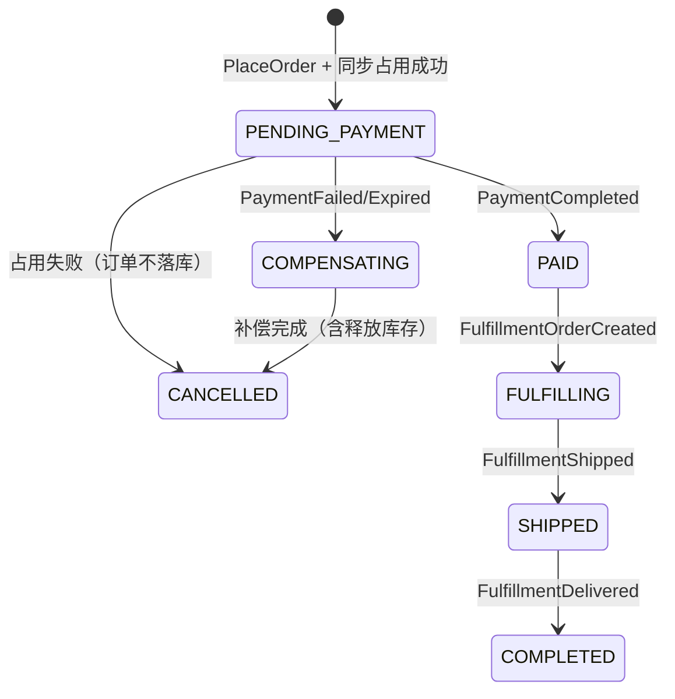

# Order 限界上下文 - Saga 设计

将事件流转化为可实现的分布式事务方案。流程与契约见 [event-flow.md](./event-flow.md)，领域结构见 [domain-model.md](./domain-model.md)。

---

## 一、编排模式

**编排式 Saga**：Order BC 作为协调者，主动调用下游 BC（同步或监听事件），驱动下一步或触发补偿。

---

## 二、Saga 步骤

### 正向步骤

| 步骤 | 触发 | 执行 BC | 方式 | 产出事件 | 失败时 |
|------|------|---------|------|----------|--------|
| T1 | PlaceOrder | Order | — | OrderCreated | 无补偿 |
| T2 | OrderCreated 前 | Inventory | **同步调用** occupy | 无 | 占用失败则 T1 不完成，订单不落库 |
| T3 | PlaceOrder 流程内 | Payment | **同步调用** createPayment | 支付链接；支付完成由网关回调后 Payment 发事件，Order 订阅 | C2, C1 |
| T4 | PaymentCompleted | Fulfillment | 调用 | FulfillmentOrderCreated | C3, C2, C1 |
| T5+ | FulfillmentShipped / Delivered | — | Order 订阅 | 更新 status | — |

T1～T3 同请求：落单 → occupy → createPayment → 发布 OrderCreated、返回支付链接。

### 补偿步骤

| 步骤 | 动作 | 调用 BC | 方式 |
|------|------|---------|------|
| C1 | 取消订单 | Order | 更新 status、发布 OrderCancelled |
| C2 | 释放库存 | Inventory | **同步调用** release(orderId) |
| C3 | 退款 | Payment | **同步调用** refund(orderId) |
| C4 | 取消履约单 | Fulfillment | 调用/事件 |

补偿顺序：失败步骤之后的正向步骤，按**逆序**补偿（如 T3 失败 → 执行 C2, C1）。

---

## 三、Saga 状态机

---

## 四、补偿触发

| 来源 | 触发补偿 |
|------|----------|
| PaymentFailed | C2, C1 |
| PaymentExpired | C2, C1 |
| 用户取消 | 按当前已完成的步骤逆序补偿（含 C2 释放库存） |

---

## 五、Saga 日志（建议）

| 字段 | 说明 |
|------|------|
| saga_id | Saga 实例 ID |
| order_id | 关联订单 |
| current_step | 当前步骤 |
| status | PENDING \| RUNNING \| COMPLETED \| COMPENSATING \| FAILED |
| step_log | 步骤执行记录（step_id, status, timestamp） |

用于重试、幂等与补偿恢复。
