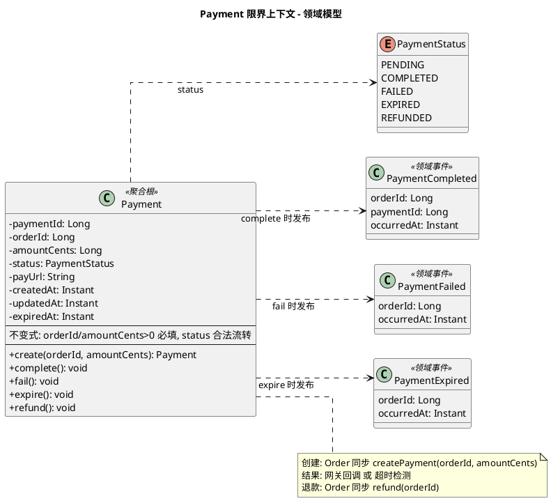

# Payment 限界上下文 - 领域模型

聚合、实体、状态与事件归属。集成契约与事件流见 [event-flow.md](./event-flow.md)，需求见 [requirements.md](./requirements.md)。

---

## 一、职责说明

Payment BC 负责**支付单的创建、支付结果处理、退款与超时检测**。核心聚合为**支付单（Payment）**：由 Order 同步创建，由网关回调或内部超时驱动状态变更，并发布领域事件供 Order 等订阅。

---

## 模型图（PlantUML）

---

## 二、实体与属性

### Payment — 聚合根

| 属性 | 类型 | 说明 |
|------|------|------|
| paymentId | Long | 唯一标识 |
| orderId | Long | 订单 ID，引用 Order BC，创建后不变 |
| amountCents | Long | 金额（分），>0 |
| status | PaymentStatus | 支付单状态 |
| payUrl | String | 支付链接（网关或模拟），供前端跳转 |
| createdAt | Instant | 创建时间 |
| updatedAt | Instant | 更新时间 |
| expiredAt | Instant | 约定超时时间，用于超时检测 |

**PaymentStatus**：PENDING | COMPLETED | FAILED | EXPIRED | REFUNDED

**不变式**：orderId、amountCents>0 必填；status 仅允许合法流转（见下）。

**状态流转**：
- 创建后：**PENDING**
- 网关回调成功 → **COMPLETED**，发布 PaymentCompleted
- 网关回调失败 → **FAILED**，发布 PaymentFailed
- 超时检测触发 → **EXPIRED**，发布 PaymentExpired
- 退款成功 → **REFUNDED**（或保留 COMPLETED + 退款标识，按实现选择）

**领域行为**（概念层）：
- `complete()`：仅当 PENDING 时可执行，置 COMPLETED 并发布 PaymentCompleted（幂等：已 COMPLETED 不重复发布）
- `fail()`：仅当 PENDING 时可执行，置 FAILED 并发布 PaymentFailed
- `expire()`：仅当 PENDING 且已过 expiredAt 时可执行，置 EXPIRED 并发布 PaymentExpired
- `refund()`：仅当 COMPLETED 时可执行，置 REFUNDED（幂等：已 REFUNDED 直接成功）

---

## 三、领域事件与归属

所有事件归属 **Payment** 聚合，命名规范：`Payment{动作过去式}`。

| 事件 | 时机 | 载荷 | 订阅方（典型） |
|------|------|------|----------------|
| PaymentCompleted | 网关回调支付成功（或模拟） | orderId, paymentId, occurredAt | Order（置 PAID、创建履约单） |
| PaymentFailed | 网关回调支付失败 | orderId, occurredAt | Order（取消、补偿） |
| PaymentExpired | 超时检测到未支付 | orderId, occurredAt | Order（取消、补偿） |

可选：若需显式通知退款完成，可增加 **PaymentRefunded**（orderId, occurredAt）；当前 requirements 允许仅做本地状态更新。

---

## 四、与 Event Flow / Requirements 的对应

- **创建支付**：Order 调用 createPayment(orderId, amountCents) → 聚合根 Payment 创建，状态 PENDING，返回 paymentId、payUrl；同一 orderId 幂等。
- **支付结果**：网关回调 → 聚合 complete() / fail()，更新 status 并发布对应事件；重复成功回调幂等。
- **超时**：定时/延迟任务根据 expiredAt 与 status 调用 expire()，仅对 PENDING 且已过期生效。
- **退款**：Order 调用 refund(orderId) → 聚合 refund()，仅 COMPLETED 可退；同一 orderId 幂等。

---

## 五、实体与表

| 模型 | 表名 |
|------|------|
| Payment | payments |

无子实体；若需审计可扩展 payment_events 等按实现选择。
