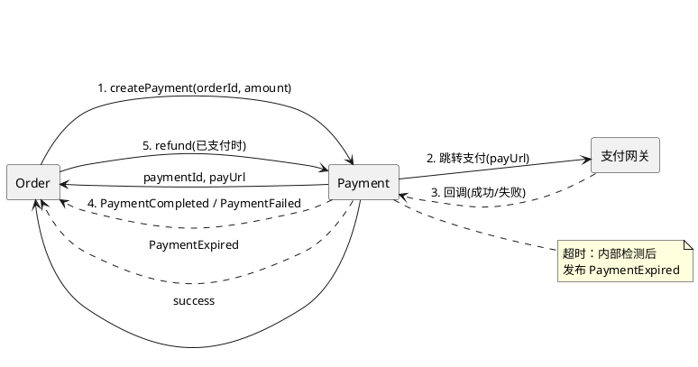

# Payment 限界上下文 - 事件流与集成契约

与 Order 的集成方式、入站 API、出站事件及支付网关边界。需求列表见 [requirements.md](./requirements.md)。

---

## 一、集成方式

- **入站**：Order 通过 **REST/同步调用** 创建支付单（createPayment）、退款（refund）；支付网关通过 **HTTP 回调** 通知支付结果。
- **出站**：Payment 根据支付结果通过 **Kafka** 发布领域事件（PaymentCompleted / PaymentFailed / PaymentExpired），Order 通过 Kafka Consumer 订阅并驱动状态与下游履约。不使用 Spring 进程内事件（跨应用通信统一走 Kafka）。

---

## 二、参与方

| BC / 系统 | 关系 |
|-----------|------|
| Order | 上游：同步调用 createPayment、refund |
| Payment | 本 BC：支付单生命周期、回调处理、超时、事件发布 |
| 支付网关 | 外部：用户完成支付后回调 Payment；真实实现为支付宝/微信等，当前可为模拟网关 |

---

## 三、协作与交互概览

BC 为节点；实线 = 同步调用，虚线 = 事件。



流程简述：Order 同步创建支付单 → 用户跳转网关完成支付 → 网关回调 Payment → Payment 发布事件通知 Order；超时由 Payment 内部检测并发布 PaymentExpired；Order 取消且已支付时同步调用退款。

---

## 四、调用契约（Order → Payment）

### 创建支付单

| 调用方 | 时机 | 入参 | 返回值 |
|--------|------|------|--------|
| Order | PlaceOrder 且库存占用成功后 | orderId, amountCents | paymentId, payUrl；失败时 4xx |

- 幂等：同一 orderId 再次调用返回已有支付单信息。

### 退款

| 调用方 | 时机 | 入参 | 返回值 |
|--------|------|------|--------|
| Order | CancelOrder 且订单已支付时 | orderId | 成功 / 业务错误（未支付等） |

- 幂等：已退款则返回成功。

---

## 五、支付网关回调（Gateway → Payment）

| 回调结果 | Payment 行为 | 发布事件 |
|----------|--------------|----------|
| 成功 | 支付单置 COMPLETED | PaymentCompleted（orderId, paymentId） |
| 失败 | 支付单保持 PENDING（用户可重试） | PaymentFailed（orderId）——通知本次尝试失败 |

**超时**：由 Payment 内部自动检测，不依赖网关回调；状态置 EXPIRED，发布 PaymentExpired（orderId）。

回调 API 形式建议：`POST /api/payments/callback` 或网关约定的 notify URL，请求体含 paymentId、结果状态、签名等（具体与网关契约一致；模拟时可简化为 paymentId + status）。

---

## 六、无真实网关时的模拟方案（开发/测试）

无真实支付网关时，Payment 通过 **PaymentGatewayPort** 对接网关；使用 **Mock Adapter** 替代，payUrl 由 Mock 返回。回调需可操控以支持测试。

| 驱动方式 | 用途 | 说明 |
|----------|------|------|
| **模拟网关页面** | 手工验证、E2E | payUrl 指向如 `/mock-pay?paymentId=xxx`，页面提供「成功」「失败」按钮，点击后调用 Payment callback 接口 |
| **测试 API** | 集成测试、ATDD | 仅在 test profile 暴露，如 `POST /api/test/payments/{paymentId}/simulate-callback?result=success|failure`，程序直接触发 callback |

流程关系：

```
Order                          Payment                        模拟网关/测试
  |                               |                                    |
  | createPayment(orderId, amount)|                                    |
  |------------------------------>|                                    |
  |                               | PaymentGatewayPort (MockAdapter)   |
  |                               | 返回 payUrl = /mock-pay?paymentId=x |
  |   paymentId, payUrl           |                                    |
  |<------------------------------|                                    |
  |                               |                                    |
  | (前端跳转 payUrl 或测试调用 simulate-callback)                       |
  |                               |<----------- 回调(成功/失败) --------|
  |                               | 发布 PaymentCompleted/Failed        |
  |<-------- 事件 ----------------|                                    |
```

---

## 七、事件契约（Payment 发布）

事件归属与聚合定义见 [domain-model.md](./domain-model.md)。

### 事件列表

| 事件 | 时机 | 载荷 | 订阅方（典型） |
|------|------|------|----------------|
| PaymentCompleted | 网关回调支付成功 / 模拟成功 | orderId, paymentId, occurredAt | Order（置 PAID、创建履约单） |
| PaymentFailed | 网关回调支付失败 | orderId, occurredAt | Order（不变更状态，仅通知）、Activity |
| PaymentExpired | 超时检测到未支付 | orderId, occurredAt | Order（取消、补偿） |

### Kafka 发布（已实现）

| Topic | 事件 | 消息体（JSON）示例 |
|-------|------|---------------------|
| `payment.completed` | PaymentCompleted | eventType, orderId, paymentId, occurredAt |
| `payment.failed` | PaymentFailed | eventType, orderId, occurredAt |
| `payment.expired` | PaymentExpired | eventType, orderId, occurredAt |

---

## 八、流程概览

```
Order                          Payment                        网关
  |                               |                              |
  | createPayment(orderId, amount)|                              |
  |------------------------------>|                              |
  |   paymentId, payUrl           |                              |
  |<------------------------------|                              |
  |                               |                              |
  | (前端跳转 payUrl)              |                              |
  |                               |<-------- 用户支付 ---------->|
  |                               |<-------- 回调(成功/失败) -----|
  |                               | 发布 PaymentCompleted/Failed |
  |<-------- 事件 ----------------|                              |
  | 更新订单状态 / 创建履约单等     |                              |
  |                               |                              |
  | refund(orderId)               |                              |
  |------------------------------>|                              |
  |   success                     |                              |
  |<------------------------------|                              |
```

超时：Payment 内部在配置的超时时长内未收到成功/失败回调时，将支付单置为 EXPIRED 并发布 PaymentExpired，Order 订阅后执行取消与补偿。

---

## 九、与 Order Saga 的对应

| Saga 步骤 | Order 动作 | Payment 角色 |
|-----------|------------|--------------|
| T3（同步） | placeOrder 流程中调用 createPayment | 提供 createPayment，返回 payUrl；后续由回调驱动事件 |
| 事件驱动 | 订阅 PaymentCompleted / Failed / Expired | 发布上述事件 |
| C3（补偿） | cancelOrder 且已支付时调用 refund | 提供 refund 接口，同步退款 |

以上为 Payment BC 的事件流与集成契约，可与 [order/event-flow.md](../order/event-flow.md) 对照实现。
