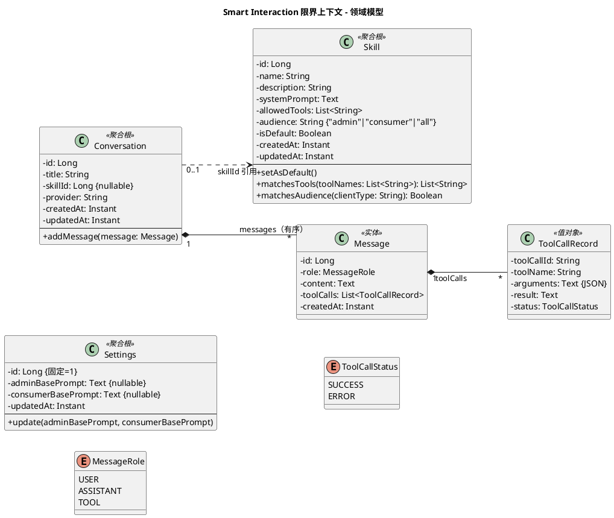

# Smart Interaction 限界上下文 - 领域模型

聚合、实体、值对象。技术架构见 [architecture.md](./architecture.md)，需求列表见 [requirements.md](./requirements.md)。

---

## 一、职责说明

Smart Interaction 提供智能交互能力：管理员和消费者通过自然语言与系统对话，借助 Skill 定义的上下文和工具范围，由 LLM + MCP Tool Calling 编排执行业务操作。

核心领域概念：
- **Skill**：定义 AI 助手在特定场景下的行为（角色、知识、可用工具）
- **Conversation**：一次对话会话，包含有序的消息列表
- **Settings**：系统级配置（单例）

---

## 二、模型图（PlantUML）

---

## 三、聚合详述

### 3.1 Skill（聚合根）

Skill 定义了 AI 助手在特定场景下的行为，是 Smart Interaction 的核心领域概念。

| 属性 | 类型 | 说明 |
|------|------|------|
| id | Long | 自增主键 |
| name | String | Skill 名称，如"库存管理助手" |
| description | String | Skill 描述，帮助用户理解其用途 |
| systemPrompt | Text | 注入给 LLM 的系统提示词（角色定义、领域知识、行为规则） |
| allowedTools | List\<String\> | 限定可用工具范围，支持通配符（如 `inventory_*`）；空列表或 `["*"]` 表示不过滤 |
| audience | String | 适用端：`"admin"`（仅管理后台）、`"consumer"`（仅消费者前台）、`"all"`（两端均可，默认） |
| isDefault | Boolean | 是否为默认 Skill，全局最多一个 |
| createdAt | Instant | 创建时间 |
| updatedAt | Instant | 最后修改时间 |

**不变式**：
- `name` 不能为空
- `isDefault = true` 的 Skill 全局最多一个；设置新的默认时自动取消旧的
- `audience` 必须是 `"admin"`、`"consumer"` 或 `"all"` 之一

**行为**：
- `setAsDefault()`：将此 Skill 标记为默认
- `matchesTools(toolNames)`：根据 `allowedTools`（含通配符匹配）过滤传入的工具名列表，返回匹配的子集
- `matchesAudience(clientType)`：判断此 Skill 是否适用于给定的客户端类型。`audience = "all"` 匹配任何 clientType；clientType 为 null 时不过滤（向后兼容）

**allowedTools 通配符规则**：
- `inventory_*`：匹配所有以 `inventory_` 开头的工具
- `catalog_list_skus`：精确匹配
- `*` 或空列表：匹配所有工具（不过滤）

### 3.2 Conversation（聚合根）

一次对话会话，包含有序的消息列表。

| 属性 | 类型 | 说明 |
|------|------|------|
| id | Long | 自增主键 |
| title | String | 对话标题（可自动生成，也可用户编辑） |
| skillId | Long (nullable) | 关联的 Skill ID，可为空（使用默认 Skill） |
| provider | String | 使用的模型提供商 ID |
| createdAt | Instant | 创建时间 |
| updatedAt | Instant | 最后活跃时间 |

**子实体 — Message**：

| 属性 | 类型 | 说明 |
|------|------|------|
| id | Long | 自增主键 |
| role | MessageRole | USER / ASSISTANT / TOOL |
| content | Text | 消息内容（ASSISTANT 可含 Markdown） |
| toolCalls | List\<ToolCallRecord\> | ASSISTANT 消息附带的 tool call 记录 |
| createdAt | Instant | 消息时间 |

**值对象 — ToolCallRecord**（内嵌于 Message）：

| 属性 | 类型 | 说明 |
|------|------|------|
| toolCallId | String | LLM 分配的 call ID |
| toolName | String | 工具名（如 `catalog_list_categories`） |
| arguments | Text (JSON) | 调用参数 |
| result | Text | 执行结果 |
| status | ToolCallStatus | SUCCESS / ERROR |

**不变式**：
- messages 按 createdAt 有序
- 删除 Conversation 时级联删除其 messages

### 3.3 Settings（聚合根，单例）

系统级配置，全局只有一条记录。

| 属性 | 类型 | 说明 |
|------|------|------|
| id | Long | 固定为 1 |
| adminBasePrompt | Text (nullable) | 管理端基础 system prompt 模板；null 时使用代码内默认值。支持 `%s` 占位符（当前页面路径） |
| consumerBasePrompt | Text (nullable) | 消费端基础 system prompt 模板；null 时使用代码内默认值。支持 `%s` 占位符 |
| updatedAt | Instant | 最后修改时间 |

**不变式**：
- 全局仅一条记录（id = 1）

**行为**：
- `update(adminBasePrompt, consumerBasePrompt)`：更新 base prompt 配置，空白字符串视为 null（使用默认值）

---

## 四、数据库表映射

### skill 表

| 列 | 类型 | 约束 |
|----|------|------|
| id | BIGSERIAL | PK |
| name | VARCHAR(100) | NOT NULL |
| description | VARCHAR(500) | |
| system_prompt | TEXT | |
| allowed_tools | TEXT | JSON 数组，如 `["inventory_*"]` |
| audience | VARCHAR(20) | NOT NULL, DEFAULT 'all' |
| is_default | BOOLEAN | NOT NULL, DEFAULT FALSE |
| created_at | TIMESTAMPTZ | NOT NULL |
| updated_at | TIMESTAMPTZ | NOT NULL |

### conversation 表

| 列 | 类型 | 约束 |
|----|------|------|
| id | BIGSERIAL | PK |
| title | VARCHAR(200) | |
| skill_id | BIGINT | FK → skill(id), NULLABLE |
| provider | VARCHAR(50) | NOT NULL |
| created_at | TIMESTAMPTZ | NOT NULL |
| updated_at | TIMESTAMPTZ | NOT NULL |

### message 表

| 列 | 类型 | 约束 |
|----|------|------|
| id | BIGSERIAL | PK |
| conversation_id | BIGINT | FK → conversation(id), NOT NULL |
| role | VARCHAR(20) | NOT NULL, CHECK (USER/ASSISTANT/TOOL) |
| content | TEXT | |
| tool_calls | TEXT | JSON，ToolCallRecord 数组 |
| created_at | TIMESTAMPTZ | NOT NULL |

### settings 表

| 列 | 类型 | 约束 |
|----|------|------|
| id | BIGINT | PK, DEFAULT 1, CHECK (id = 1) |
| admin_base_prompt | TEXT | NULLABLE |
| consumer_base_prompt | TEXT | NULLABLE |
| updated_at | TIMESTAMPTZ | NOT NULL |
