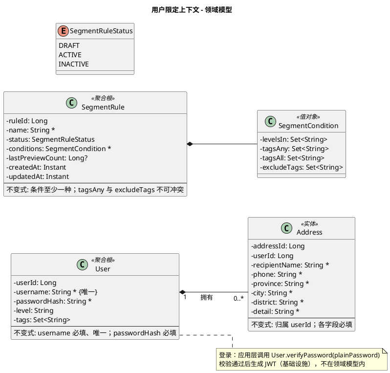

# 用户限定上下文 - 领域模型

与需求、契约对照；实现以本文档为准。

> 以下增量来自业务需求 [用户分群与圈选](../../business-requirements/user-management-theme/user-segmentation/overview.md)。

---

## 模型图（PlantUML）

修改模型时改此处即可；渲染见 [PlantUML](https://www.plantuml.com/plantuml) 或 IDE 插件。

---

## 实体与属性说明

### User（用户）— 聚合根

| 属性       | 类型   | 说明 |
|------------|--------|------|
| UserID     | Long   | 唯一标识 |
| Username   | String | 必填，全局唯一，用于登录 |
| PasswordHash | String | 必填，加密后的密码，用于登录校验 |
| level | String | 🔄 用户等级（用于促销定向，如 L1/L2/L3） |
| tags | Set\<String\> | 🔄 用户标签集合（如 NEW_USER、VIP） |

**不变式**：Username 必填、全局唯一；PasswordHash 必填。`level` 可为空（默认等级），`tags` 可为空集合。

**领域方法**：
- `verifyPassword(plainPassword: String): boolean` — 校验明文密码是否与 passwordHash 匹配，由应用层在登录时调用。
- `segments(): UserSegments` — 返回 level + tags（供 Promotion 同步判定用户定向命中）。
- `updateLevel(level: String)` — 更新用户等级（受等级白名单约束）。
- `replaceTags(tags: Set<String>)` — 全量覆盖用户标签（用于运营维护）。

### Address（收货地址）— 实体

| 属性         | 类型   | 说明 |
|--------------|--------|------|
| addressId    | Long   | 唯一标识 |
| userId       | Long   | 归属用户 |
| recipientName| String | 收件人姓名，必填 |
| phone        | String | 手机号，必填 |
| province     | String | 省/直辖市，必填 |
| city         | String | 城市，必填 |
| district     | String | 区/县，必填 |
| detail       | String | 详细地址，必填 |

**不变式**：归属 userId；各字段必填、非空。与 Order ShippingAddress 字段一一对应，便于结账时引用。

### SegmentRule（圈选规则）— 聚合根

| 属性 | 类型 | 说明 |
|------|------|------|
| ruleId | Long | 规则唯一标识 |
| name | String | 规则名称，必填 |
| status | SegmentRuleStatus | 生命周期：DRAFT/ACTIVE/INACTIVE |
| conditions | SegmentCondition | 圈选条件（等级与标签组合） |
| lastPreviewCount | Long? | 最近预览命中人数（可空） |
| createdAt/updatedAt | Instant | 创建与更新时间 |

**不变式**：
- conditions 至少包含一个非空条件
- `tagsAny` 与 `excludeTags` 不得出现同值冲突
- 默认仅在 `lastPreviewCount > 0` 时允许从 DRAFT 激活（后续可放宽）

### SegmentCondition（值对象）

| 属性 | 类型 | 说明 |
|------|------|------|
| levelsIn | Set\<String\> | 可选等级集合（命中任一等级） |
| tagsAny | Set\<String\> | 任一标签命中 |
| tagsAll | Set\<String\> | 必须全部命中标签 |
| excludeTags | Set\<String\> | 排除标签（命中即淘汰） |

**领域方法（规则引擎）**：
- `matches(user.level, user.tags): boolean`
- `explainMismatch(...): List<String>`（用于预览可解释输出）

---

## 实体与表

| 模型   | 表名         |
|--------|--------------|
| User   | user_account |
| Address| user_address |
| SegmentRule | user_segment_rule |

不变式由应用层校验。
