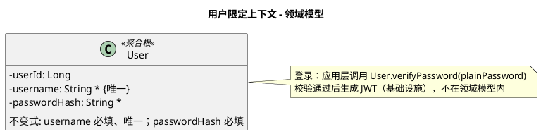

# 用户限定上下文 - 领域模型

与需求、契约对照；实现以本文档为准。

---

## 模型图（PlantUML）

修改模型时改此处即可；渲染见 [PlantUML](https://www.plantuml.com/plantuml) 或 IDE 插件。

---

## 实体与属性说明

### User（用户）— 聚合根

| 属性       | 类型   | 说明 |
|------------|--------|------|
| UserID     | Long   | 唯一标识 |
| Username   | String | 必填，全局唯一，用于登录 |
| PasswordHash | String | 必填，加密后的密码，用于登录校验 |

**不变式**：Username 必填、全局唯一；PasswordHash 必填。

**领域方法**：
- `verifyPassword(plainPassword: String): boolean` — 校验明文密码是否与 passwordHash 匹配，由应用层在登录时调用。

---

## 实体与表

| 模型 | 表名 |
|------|------|
| User | user_account |

不变式由应用层校验。
