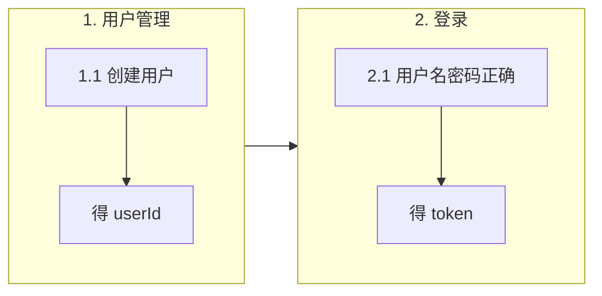

# 用户限定上下文 - 需求列表

每个功能对应一个 .feature 文件，场景对应 Gherkin Scenario。契约：`docs/bounded-contexts/user/api.yaml`。Feature 目录：`services/user-service/src/test/resources/features/user/`。

### 状态图例

- ✅ 已实现（后端 + 测试 + 契约均已完成）
- 🔲 待实现

### 主路径示意（操作顺序）

顺序：先创建用户，再登录；登录需已有用户。

---

## 1. 管理用户  
`user.feature`

- ✅ 1.1 创建用户时应成功并返回 userId 和 username
- ✅ 1.2 用户名已存在时创建用户应失败并返回错误提示
- ✅ 1.3 用户名为空时创建用户应失败并返回错误提示
- ✅ 1.4 密码为空时创建用户应失败并返回错误提示
- ✅ 1.5 按 ID 请求用户详情时应返回用户信息（不含 passwordHash）
- ✅ 1.6 请求用户列表时应返回用户列表
- ✅ 1.7 用户不存在时请求详情应返回 404

---

## 2. 登录  
`login.feature`

- ✅ 2.1 用户名和密码正确时登录应成功并返回 token
- ✅ 2.2 用户不存在时登录应失败并返回 401
- ✅ 2.3 密码错误时登录应失败并返回 401
- ✅ 2.4 用户名为空时登录应失败并返回错误提示
- ✅ 2.5 密码为空时登录应失败并返回错误提示

---

## 3. 收货地址管理  
`address.feature`

- ✅ 3.1 用户新增收货地址时应成功并返回 addressId
- ✅ 3.2 收货地址必填项缺省或格式不合法时应失败并返回错误
- ✅ 3.3 按 userId 查询时应返回该用户的地址列表
- ✅ 3.4 按 addressId 查询时应返回地址详情（若属该用户）
- ✅ 3.5 用户修改自己的地址时应成功
- ✅ 3.6 用户删除自己的地址时应成功
- ✅ 3.7 地址不存在或不属于该用户时应返回 404

---

## 功能与 feature 对应

| 功能 | .feature 文件 | 场景数 | 状态 |
|------|----------------|--------|------|
| 1. 管理用户 | user.feature | 1.1～1.7 | ✅ 已实现 |
| 2. 登录 | login.feature | 2.1～2.5 | ✅ 已实现 |
| 3. 收货地址管理 | address.feature | 3.1～3.7 | ✅ 已实现 |
