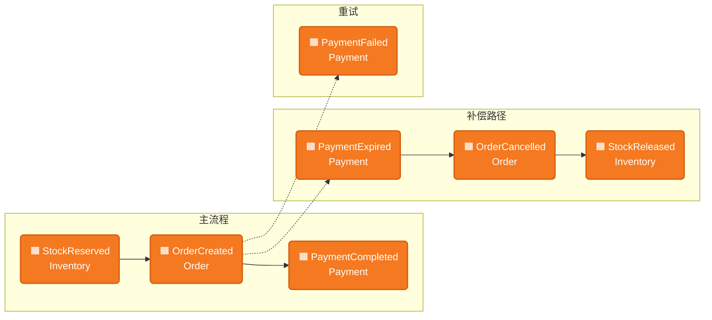
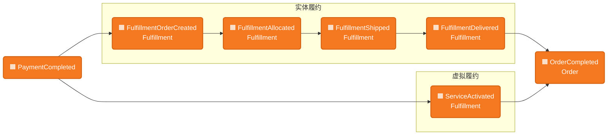

# 业务流程全景（Business Flows）

系统支持的端到端业务流程。是**需求分析**、**E2E 测试设计**和**事件定义**的统一依据。

> 系统结构与 BC 集成关系见 [context-map.md](context-map.md)；前端测试策略见 [frontend/web/testing.md](frontend/web/testing.md)。

---

## 一、电商价值流与当前范围

```
Intention → Needs → Paid Order → Fulfillment → Service / Use
 (购物意图)  (明确需求)  (已支付订单)   (履约完成)    (服务与使用)
```

| 阶段 | 含义 | 示例 |
|------|------|------|
| **Intention** | 用户有模糊的购物意图 | CPC 广告引流、活动页浏览、搜索 |
| **Needs** | 意图转化为明确的商品需求 | 进入详情页、加入购物车 |
| **Paid Order** | 需求转化为已支付的订单 | 下单 + 支付完成 |
| **Fulfillment** | 已支付订单完成履约 | 发货签收、服务激活 |
| **Service / Use** | 用户持续使用或接受服务 | 售后、退保、续费 |

**当前系统覆盖中间两段**，将来向两端扩展：

```
Needs ──→ Paid Order ──→ Fulfillment
├─── N2O（转化段）───┤├─── O2F（履约段）───┤
```

| 段 | 简称 | 范围 | 分界事件 | 涉及 BC |
|----|------|------|---------|---------|
| **Needs → Paid Order** | N2O | 用户明确需求 → 支付完成 | PaymentCompleted | Cart、Catalog、User、Order、Inventory、Payment |
| **Paid Order → Fulfillment** | O2F | 已支付订单 → 履约完成 | OrderCompleted | Fulfillment、Order |

**N2O ⊥ O2F**：两段通过"已支付的订单"解耦。不管用户从哪个入口下单，生成的订单结构相同，O2F 看不到入口来源。两段可独立验证、独立扩展。

---

## 二、事件流

事件流是业务流程的骨架。图中 🟧 为领域事件，⌘ 为命令，⟳ 为策略（事件触发的自动反应）。

### N2O 事件流（转化段）



- **主流程**：⌘ PlaceOrder → 同步占库存 → StockReserved → 同步创建支付单 → OrderCreated → 用户支付 → PaymentCompleted
- **补偿**：支付超时 → PaymentExpired ⟳ 取消订单 → OrderCancelled ⟳ 释放库存 → StockReleased
- **重试**：PaymentFailed 不触发取消，用户可重试支付

### O2F 事件流（履约段）



- **实体履约**：PaymentCompleted ⟳ 创建履约单 → FulfillmentOrderCreated → 配货 → Allocated → 发货 → Shipped → 签收 → Delivered
- **虚拟履约**：PaymentCompleted ⟳ 创建虚拟履约单 → 立即激活 → ServiceActivated
- **完成**：Order 按最慢原则——所有履约单完成后 → OrderCompleted
- **混合订单**：拆为实体履约单 + 虚拟履约单，各自独立推进

### 事件连接

N2O 以 **PaymentCompleted** 结束，O2F 以 **PaymentCompleted** 开始。这个事件既是 N2O 的终点，也是 O2F 的起点——两段的连接点。

---

## 三、事件总表

所有跨 BC 领域事件。**orderId** 是系统级关联键，贯穿所有 BC。

### Order 发布

| 事件 | 触发 | Topic | 订阅方 | 关键 Payload |
|------|------|-------|--------|-------------|
| OrderCreated | ⌘ PlaceOrder | `order.created` | Activity | orderId, items[{skuId, quantity}], occurredAt |
| OrderCancelled | ⟳ PaymentExpired 或 ⌘ CancelOrder | `order.cancelled` | Activity | orderId, occurredAt |
| OrderCompleted | ⟳ 全部履约单完成 | `order.completed` | Activity | orderId, occurredAt |

### Payment 发布

| 事件 | 触发 | Topic | 订阅方 | 关键 Payload |
|------|------|-------|--------|-------------|
| PaymentCompleted | 网关支付成功回调 | `payment.completed` | Order, Activity | orderId, paymentId, occurredAt |
| PaymentFailed | 网关支付失败回调 | `payment.failed` | Order, Activity | orderId, occurredAt（不触发取消，用户可重试） |
| PaymentExpired | 超时检测 | `payment.expired` | Order, Activity | orderId, occurredAt |

### Inventory 发布

| 事件 | 触发 | Topic | 订阅方 | 关键 Payload |
|------|------|-------|--------|-------------|
| StockReserved | ⌘ PlaceOrder → 同步占用 | `inventory.stock.reserved` | Activity | orderId, items[{skuId, quantity}], occurredAt |
| StockReleased | ⟳ 取消补偿 → 同步释放 | `inventory.stock.released` | Activity | orderId, occurredAt |

### Fulfillment 发布

| 事件 | 触发 | Topic | 订阅方 | 关键 Payload |
|------|------|-------|--------|-------------|
| FulfillmentOrderCreated | ⟳ PaymentCompleted → 同步创建 | `fulfillment.order.created` | Activity | orderId, fulfillmentOrderIds, occurredAt |
| FulfillmentAllocated | 管理后台配货 | `fulfillment.order.allocated` | Order, Activity | orderId, fulfillmentOrderId, occurredAt |
| FulfillmentShipped | 发货 | `fulfillment.shipped` | Order, Activity | orderId, fulfillmentOrderId, occurredAt |
| FulfillmentDelivered | 签收确认 | `fulfillment.delivered` | Order, Activity | orderId, fulfillmentOrderId, occurredAt |
| ServiceActivated | 虚拟履约单激活 | `fulfillment.service.activated` | Order, Activity | orderId, fulfillmentOrderId, serviceSkuId, activatedAt, expiresAt, occurredAt |

### 事件约定

| 约定 | 说明 |
|------|------|
| 关联键 | orderId（交易中心聚合标识） |
| 幂等键 | eventId（UUID），发布方生成 |
| 消息格式 | JSON：eventType, orderId, 业务字段, occurredAt |
| 传输 | Kafka；Topic 命名 `<bc>.<event-type>` |
| 消费语义 | at-least-once，消费方保证幂等 |

---

## 四、路径枚举与测试覆盖

### N2O 路径

段内变量维度：**下单入口 × 商品类型**（有交互——购物车对虚拟商品有特殊展示和分组）。

| 编号 | 路径 | 描述 | Smoke | Business E2E |
|------|------|------|-------|-------------|
| **N2O-1** | 直接购买实体 | 详情页 → 立即购买 → 结账 → 支付 | SMOKE-001 P0 | — |
| **N2O-2** | 购物车结算实体 | 详情页 → 加购 → 购物车 → 结算 → 结账 → 支付 | SMOKE-003 P0 | — |
| **N2O-3** | 直接购买实体+虚拟 | 详情页选服务 → 立即购买 → 结账 → 支付 | SMOKE-002 P1 | BIZ-VP-001 |
| **N2O-4** | 购物车结算实体+虚拟 | 详情页选服务 → 加购 → 购物车 → 结算 → 结账 → 支付 | — | BIZ-VP-002 |

### O2F 路径

段内变量维度：**商品类型 × 履约方式**（有交互——虚拟商品走即时激活，混合订单需拆单）。

| 编号 | 路径 | 描述 | 主验证层 |
|------|------|------|---------|
| **O2F-1** | 实体履约 | 配货 → 发货 → 签收 | Fulfillment BC Cucumber + SMOKE-001 顺带 |
| **O2F-2** | 混合履约 | 实体物流 + 虚拟即时激活；最慢原则 | Fulfillment BC Cucumber + BIZ-VP-001 顺带 |
| **O2F-3** | 纯虚拟履约 | 创建后即激活 | Fulfillment BC Cucumber；🔲 E2E 待实现 |

> O2F 的业务规则由后端 Cucumber 保障。E2E 用最简入口（N2O-1）触发，验证端到端可走通。

---

## 五、与需求分析的衔接

新需求分析时（`analyze-requirement`），对照上方路径表和事件流回答：

1. **影响哪段？** N2O、O2F、还是两段？
2. **影响哪些事件？** 是否新增事件、修改现有事件的触发条件或 payload？
3. **新增路径还是影响现有路径？** 若新增，补充到路径表
4. **是否打破 N2O ⊥ O2F？** 例如某种入口决定了特殊履约方式
5. **测试覆盖是否仍完整？** 新路径是否需要 Smoke / Business E2E

---

## 六、维护规则

| 时机 | 动作 |
|------|------|
| 新业务需求分析完成 | 更新路径枚举（§四）；若新增事件则更新事件流（§二）和事件总表（§三） |
| E2E 测试新增/调整 | 更新路径表中的测试覆盖列 |
| 价值流范围扩展 | 更新 §一 |
