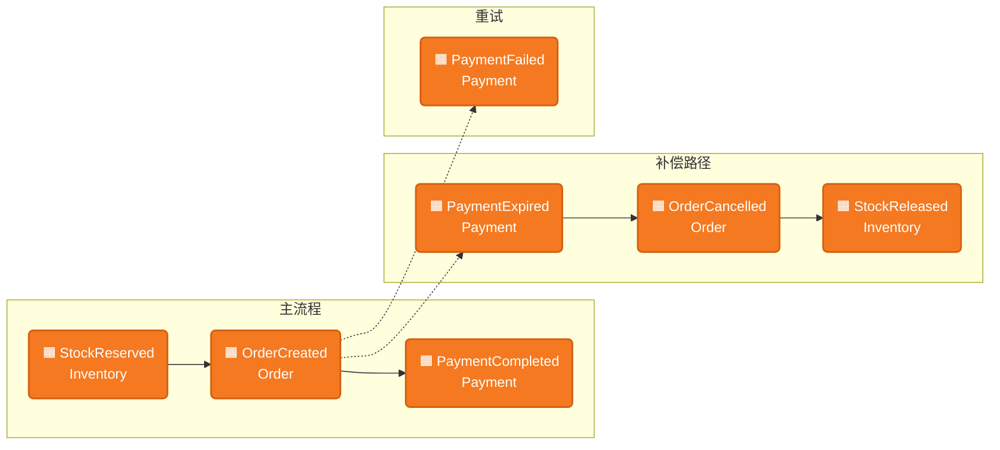
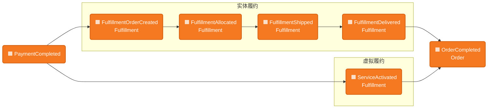

# 业务流程全景（Business Flows）

系统支持的端到端业务流程。是**需求分析**、**E2E 测试设计**和**事件定义**的统一依据。

> 系统结构与 BC 集成关系见 [context-map.md](context-map.md)；业务流程体系与演进方向见 [business-process-architecture.md](business-process-architecture.md)；前端测试策略见 [frontend/web/testing.md](frontend/web/testing.md)。

---

## 一、价值流与当前范围

```
Intention → Needs → Paid Order → Fulfillment → Service / Use
 (购物意图)  (明确需求)  (已支付订单)   (履约完成)    (服务与使用)
```

| 阶段 | 含义 | 示例 |
|------|------|------|
| **Intention** | 用户有模糊的购物意图 | CPC 广告引流、活动页浏览、搜索 |
| **Needs** | 意图转化为明确的商品需求 | 进入详情页、加入购物车 |
| **Paid Order** | 需求转化为已支付的订单 | 下单 + 支付完成 |
| **Fulfillment** | 已支付订单完成履约 | 发货签收、服务激活 |
| **Service / Use** | 用户持续使用或接受服务 | 售后、退保、续费 |

**当前系统覆盖中间两段**，将来向两端扩展：

```
Needs ──→ Paid Order ──→ Fulfillment
├─── N2O（转化段）───┤├─── O2F（履约段）───┤
```

| 段 | 简称 | 范围 | 分界事件 | 涉及 BC |
|----|------|------|---------|---------|
| **Needs → Paid Order** | N2O | 用户明确需求 → 支付完成 | PaymentCompleted | Cart、Catalog、User、Order、Inventory、Payment |
| **Paid Order → Fulfillment** | O2F | 已支付订单 → 履约完成 | OrderCompleted | Fulfillment、Order |

**N2O ⊥ O2F**：两段通过"已支付的订单"解耦。不管用户从哪个入口下单，生成的订单结构相同，O2F 看不到入口来源。两段可独立验证、独立扩展。

---

## 二、N2O：选品到支付

N2O 段分两个阶段：**选品与决策**（用户旅程，无领域事件）和**下单与支付**（事件驱动）。

### 2.1 选品与决策（用户旅程）

PlaceOrder 之前，用户经历"选品与决策"阶段——浏览商品、选择规格与增值服务、决定购买。这一阶段无领域事件，但有**数据依赖**：每一步需要从特定 BC 获取数据来驱动展示和用户选择。

有两条路径进入 PlaceOrder：

**路径 A：直接购买**

```
商品详情页 → 选规格/服务 → 结账页 → ⌘ PlaceOrder
```

**路径 B：购物车**

```
商品详情页 → 选规格/服务 → 加购 → 购物车页 → 结算 → 结账页 → ⌘ PlaceOrder
```

路径 A / B 各步骤的数据依赖：

| 步骤 | 做什么 | 数据依赖 | 来源 BC |
|------|--------|---------|---------|
| **商品详情页** | 展示 SPU/SKU 信息、规格选择、可选增值服务列表 | SPU、SpecDimension/Option、SKU、ProductImage；ServiceBinding（哪些服务可选）+ 服务 SKU 信息（名称、价格、服务类型/类目） | Catalog |
| **选规格/服务** | 用户选 SKU、勾选增值服务、填写服务相关内容 | 所选 SKU 的库存状态（可选）；服务特有数据（如图案库列表） | Catalog（图案等配置数据）、Inventory（可选） |
| **加购**（路径 B） | 将所选商品+服务写入购物车 | 所选 SKU + 服务 SKU + 数量 + 关联关系 | 前端 → Cart |
| **购物车页**（路径 B） | 展示已加购商品，服务项与实体商品分组，实时价格 | CartItem 列表；SKU 实时价格与名称 | Cart、Catalog |
| **结账页** | 汇总待下单商品、选择地址、确认服务内容 | 选中项（SKU + 服务 + 数量）；用户地址列表 | Cart（路径 B）或前端直传（路径 A）、User |

**路径 C：补购服务**

```
已交付订单详情页 → 查看可补购服务 → 选择服务 → 结账页 → ⌘ PlaceOrder
```

补购的入口不是商品详情页，而是已交付订单——用户对已购实体商品追加服务。订单仅含服务类商品，O2F 走纯虚拟履约路径（O2F-3）。

| 步骤 | 做什么 | 数据依赖 | 来源 BC |
|------|--------|---------|---------|
| **已交付订单详情页** | 展示已购商品、可补购的增值服务列表 | 订单详情（orderId、已购 SKU）；ServiceBinding → 该 SPU 可补购的服务 SKU | Order、Catalog |
| **选择服务** | 选择服务、填写服务相关内容 | 服务 SKU 信息（名称、价格）；服务特有配置数据（如图案库列表） | Catalog |
| **结账页** | 确认服务内容与价格 | 所选服务 SKU + 数量；关联的原订单信息 | 前端直传 |

> **需求分析检查点**：新需求是否在上述任一步骤（路径 A/B/C）引入了新的数据需求（新的展示字段、新的用户输入、新的 BC 查询）？若是，该步骤应作为独立场景盘点。

### 2.2 下单与支付（事件流）

事件流是业务流程的骨架。图中 🟧 为领域事件，⌘ 为命令，⟳ 为策略（事件触发的自动反应）。



- **主流程**：⌘ PlaceOrder → 同步占库存 → StockReserved → 同步创建支付单 → OrderCreated → 用户支付 → PaymentCompleted
- **补偿**：支付超时 → PaymentExpired ⟳ 取消订单 → OrderCancelled ⟳ 释放库存 → StockReleased
- **重试**：PaymentFailed 不触发取消，用户可重试支付
- **补购**：补购进入 PlaceOrder 后的事件流与上述主流程相同。区别仅在入口（已交付订单详情页）和订单内容（纯服务商品，无实体库存占用）。

---

## 三、O2F：支付到履约完成

N2O 以 **PaymentCompleted** 结束，O2F 以 **PaymentCompleted** 开始。这个事件既是 N2O 的终点，也是 O2F 的起点——两段的连接点。



- **实体履约**：PaymentCompleted ⟳ 创建履约单 → FulfillmentOrderCreated → 配货 → Allocated → 发货 → Shipped → 签收 → Delivered
- **虚拟履约**：PaymentCompleted ⟳ 创建虚拟履约单 → 立即激活 → ServiceActivated
- **完成**：Order 按最慢原则——所有履约单完成后 → OrderCompleted
- **混合订单**：拆为实体履约单 + 虚拟履约单，各自独立推进
- **🔲 含镭雕**：实体履约单可附 engravingInfo；须先 completeEngraving 后才能 ship（来自业务需求 [镭雕服务](../../business-requirements/laser-engraving/overview.md)）

---

## 四、后台管理流程

后台管理操作为 N2O 和 O2F 提供配置与流程推进能力。管理操作通常为 CRUD 或状态推进，部分操作会产生领域事件。

### 4.1 商品与库存管理（支撑 N2O）

| 操作 | BC | 说明 | 产生事件 |
|------|-----|------|---------|
| SPU/SKU 管理 | Catalog | 创建、编辑商品与规格；管理商品图片 | — |
| 上下架 | Catalog | 控制商品在前端的可见性 | — |
| 规格维度与选项 | Catalog | 管理 SPU 的规格维度（如颜色、尺寸）与选项 | — |
| 服务绑定 | Catalog | 配置实体 SPU 可选的增值服务（ServiceBinding） | — |
| 🔲 镭雕图案库 | Catalog | 配置镭雕可选图案（EngravingPattern） | — |
| 库存初始化/调整 | Inventory | 设置或调整 SKU 的可用库存数量 | — |

### 4.2 履约管理（驱动 O2F）

| 操作 | BC | 说明 | 产生事件 |
|------|-----|------|---------|
| 配货 | Fulfillment | 为履约单分配库存/拣货 | FulfillmentAllocated |
| 🔲 完成镭雕 | Fulfillment | 标记镭雕已完成。有镭雕的履约单须先完成才能发货 | EngravingCompleted（可选） |
| 发货 | Fulfillment | 填写物流信息、标记发货。有镭雕时须先完成镭雕 | FulfillmentShipped |
| 签收确认 | Fulfillment | 标记签收完成 | FulfillmentDelivered |

> **需求分析检查点**：新需求是否引入新的管理操作？是否修改已有操作的前置条件（如发货前必须完成某步骤）？若是，该操作应作为独立场景盘点。

---

## 五、事件总表

所有跨 BC 领域事件。**orderId** 是系统级关联键，贯穿所有 BC。

> **Activity BC** 订阅全量事件，作为系统级事件存储（时间线/动态流）。以下各表的「订阅方」仅列出有业务反应（触发命令或策略）的 BC，不重复列出 Activity。

### Order 发布

| 事件 | 触发 | Topic | 订阅方 | 关键 Payload |
|------|------|-------|--------|-------------|
| OrderCreated | ⌘ PlaceOrder | `order.created` | — | orderId, userId, totalAmountCents, items[{skuId, spuId, quantity, unitPriceCents}], occurredAt |
| OrderCancelled | ⟳ PaymentExpired 或 ⌘ CancelOrder | `order.cancelled` | — | orderId, userId, totalAmountCents, items[{skuId, spuId, quantity, unitPriceCents}], occurredAt |
| OrderCompleted | ⟳ 全部履约单完成 | `order.completed` | — | orderId, userId, totalAmountCents, items[{skuId, spuId, quantity, unitPriceCents}], occurredAt |

### Payment 发布

| 事件 | 触发 | Topic | 订阅方 | 关键 Payload |
|------|------|-------|--------|-------------|
| PaymentCompleted | 网关支付成功回调 | `payment.completed` | Order | orderId, paymentId, occurredAt |
| PaymentFailed | 网关支付失败回调 | `payment.failed` | Order | orderId, occurredAt（不触发取消，用户可重试） |
| PaymentExpired | 超时检测 | `payment.expired` | Order | orderId, occurredAt |

### Inventory 发布

| 事件 | 触发 | Topic | 订阅方 | 关键 Payload |
|------|------|-------|--------|-------------|
| StockReserved | ⌘ PlaceOrder → 同步占用 | `inventory.stock.reserved` | — | orderId, items[{skuId, quantity}], occurredAt |
| StockReleased | ⟳ 取消补偿 → 同步释放 | `inventory.stock.released` | — | orderId, occurredAt |

### Fulfillment 发布

| 事件 | 触发 | Topic | 订阅方 | 关键 Payload |
|------|------|-------|--------|-------------|
| FulfillmentOrderCreated | ⟳ PaymentCompleted → 同步创建 | `fulfillment.order.created` | — | orderId, fulfillmentOrderIds, occurredAt |
| FulfillmentAllocated | 管理后台配货 | `fulfillment.order.allocated` | Order | orderId, fulfillmentOrderId, occurredAt |
| FulfillmentShipped | 发货 | `fulfillment.shipped` | Order | orderId, fulfillmentOrderId, occurredAt |
| FulfillmentDelivered | 签收确认 | `fulfillment.delivered` | Order | orderId, fulfillmentOrderId, occurredAt |
| ServiceActivated | 虚拟履约单激活 | `fulfillment.service.activated` | Order | orderId, fulfillmentOrderId, serviceSkuId, activatedAt, expiresAt, occurredAt |
| 🔲 EngravingCompleted | 镭雕已完成 | `fulfillment.engraving.completed` | Activity | orderId, fulfillmentOrderId, completedAt, occurredAt |

### 事件约定

| 约定 | 说明 |
|------|------|
| 关联键 | orderId（交易中心聚合标识） |
| 幂等键 | eventId（UUID），发布方生成 |
| 消息格式 | JSON：eventType, orderId, 业务字段, occurredAt |
| 传输 | Kafka；Topic 命名 `<bc>.<event-type>` |
| 消费语义 | at-least-once，消费方保证幂等 |

---

## 六、路径枚举与测试覆盖

### N2O 路径

段内变量维度：**下单入口 × 商品类型**（有交互——购物车对虚拟商品有特殊展示和分组；补购为独立入口，纯服务订单）。

| 编号 | 路径 | 描述 | Smoke | Business E2E |
|------|------|------|-------|-------------|
| **N2O-1** | 直接购买实体 | 详情页 → 立即购买 → 结账 → 支付 | SMOKE-001 P0 | — |
| **N2O-2** | 购物车结算实体 | 详情页 → 加购 → 购物车 → 结算 → 结账 → 支付 | SMOKE-003 P0 | — |
| **N2O-3** | 直接购买实体+虚拟 | 详情页选服务 → 立即购买 → 结账 → 支付 | SMOKE-002 P1 | BIZ-VP-001 |
| **N2O-4** | 购物车结算实体+虚拟 | 详情页选服务 → 加购 → 购物车 → 结算 → 结账 → 支付 | — | BIZ-VP-002 |
| **N2O-5** | 补购服务 | 已交付订单详情页 → 查看可补购服务 → 选择 → 下单 → 支付 | — | BIZ-SP-001 |
| **N2O-6** | 直接购买实体+镭雕 | 详情页选镭雕服务+填雕刻内容 → 立即购买 → 结账 → 支付 | — | 🔲 BIZ-LE-001 |

### O2F 路径

段内变量维度：**商品类型 × 履约方式**（有交互——虚拟商品走即时激活，混合订单需拆单）。

| 编号 | 路径 | 描述 | 主验证层 |
|------|------|------|---------|
| **O2F-1** | 实体履约 | 配货 → 发货 → 签收 | Fulfillment BC Cucumber + SMOKE-001 顺带 |
| **O2F-2** | 混合履约 | 实体物流 + 虚拟即时激活；最慢原则 | Fulfillment BC Cucumber + BIZ-VP-001 顺带 |
| **O2F-3** | 纯虚拟履约 | 创建后即激活 | Fulfillment BC Cucumber；🔲 E2E 待实现 |
| **O2F-4** | 含镭雕实体履约 | 配货 → 完成镭雕 → 发货 → 签收 | Fulfillment BC Cucumber；🔲 BIZ-LE-001 顺带 |

> O2F 的业务规则由后端 Cucumber 保障。E2E 用最简入口（N2O-1）触发，验证端到端可走通。

---

## 七、需求分析检查清单

新需求分析时（`analyze-requirement`），对照上方流程和路径回答：

1. **影响哪段？** N2O、O2F、还是两段？
2. **影响选品与决策阶段吗？** 新需求是否在详情页、加购、购物车、结账任一步骤引入新的数据需求或交互（新的展示字段、新的用户输入、新的 BC 查询）？若是，该步骤应作为独立场景盘点。（对照第二章 2.1 数据依赖表逐行检查。）
3. **影响后台管理流程吗？** 是否需要新增管理操作、修改已有操作的前置条件或流程？（对照第四章后台管理流程。）
4. **影响哪些事件？** 是否新增事件、修改现有事件的触发条件或 payload？（对照第五章事件总表。）
5. **新增路径还是影响现有路径？** 若新增，补充到第六章路径表。
6. **是否打破 N2O ⊥ O2F？** 例如某种入口决定了特殊履约方式。
7. **测试覆盖是否仍完整？** 新路径是否需要 Smoke / Business E2E？

---

## 八、维护规则

| 时机 | 动作 |
|------|------|
| 新业务需求分析完成 | 更新路径枚举（第六章）；若新增管理操作则更新第四章；若新增事件则更新对应段的事件流（第二/三章）和事件总表（第五章） |
| E2E 测试新增/调整 | 更新路径表中的测试覆盖列 |
| 价值流范围扩展 | 更新第一章 |
