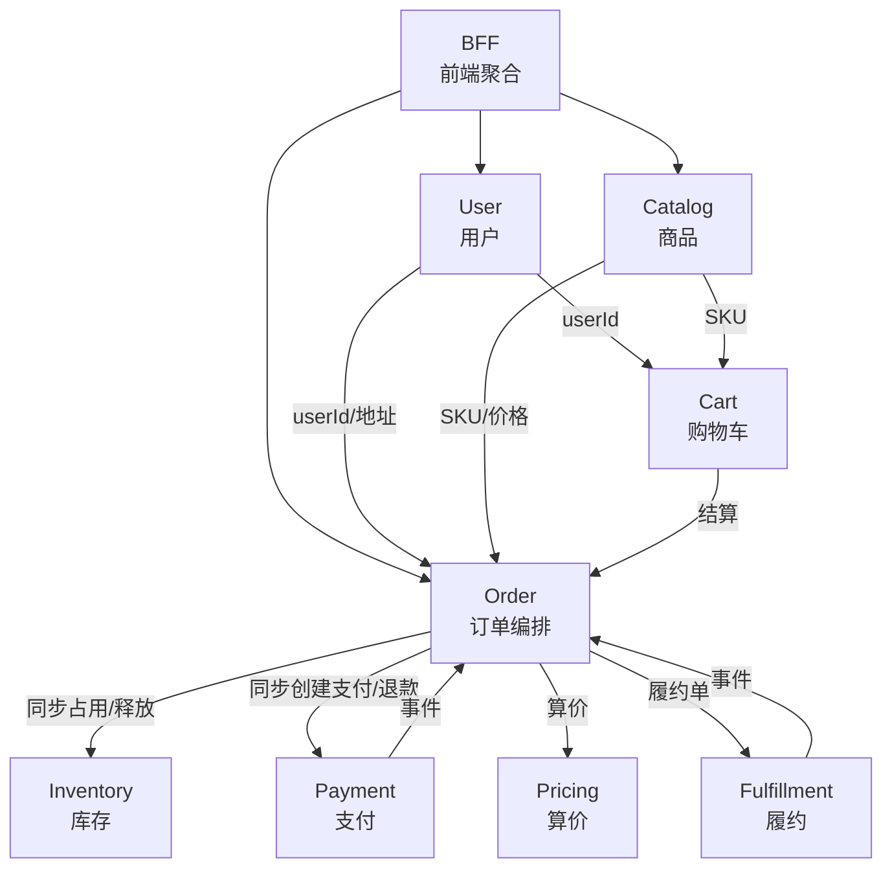

# HMall 上下文地图（Context Map）

描述各限界上下文及其之间的关系。上下游关系与集成方式会随实现演进更新。

> 进度与路线图见 [project-status.md](project-status.md)；本图侧重 BC 间关系与集成方式。

---

## 架构与部署

- **部署形态**：上下文地图中的每个限界上下文（BC）均为**独立微服务**，各自独立部署、独立扩展。
- **当前实现**：模块化单体（Modular Monolith），各 BC 以包/模块形式共存于同一应用，BC 边界与未来服务边界对齐。
- **集成技术**：REST 用于同步调用；事件用于异步编排。事件总线的具体技术选型见 [integration.md](architecture/integration.md)。

---

## 上下文概览



---

## 上下文说明

| 上下文 | 职责 | 状态 | 与 project-status 对应 |
|--------|------|------|------------------------|
| **Catalog** | 类目、商品(SPU)、规格维度、SKU、展示图 | ✅ 已实现 | 4 feature，45 scenario |
| **User** | 用户注册、登录(JWT)、收货地址管理 | ✅ 已实现 | 3 feature，19 scenario |
| **Order** | 订单创建、取消、查询、事件驱动、状态流转 | ✅ 已实现 | 4 feature，23 scenario |
| **BFF** | frontend 统一 API 入口，代理 Catalog/User/Order/Inventory | ✅ POC 完成 | 透传代理、CORS、4xx/5xx 转发 |
| **Cart** | 购物车管理 | 🔲 规划中 | 依赖 Catalog + User，按需实现 |
| **Inventory** | 同步占用/释放库存 | ✅ 已实现并已与 Order 集成 | Order 同步调用 occupy/release |
| **Payment** | 扣款/退款/超时检测 | 🔲 规划中 | Order 同步调用；支付完成由网关回调 |
| **Pricing** | 算价、优惠 | 🔲 规划中 | 同步调用 |
| **Fulfillment** | 拆单、发货、配送 | 🔲 规划中 | Order 以 Port 桩对接 |

---

## 集成关系

| 上游 | 下游 | 集成方式 | 说明 |
|------|------|----------|------|
| BFF | Catalog | REST | 代理 /api/categories、/api/products 等 |
| BFF | User | REST | 代理 /api/users、/api/login |
| BFF | Order | REST | 代理 /api/orders |
| Catalog | Order | REST | Order 创建时按 skuId 拉取 SKU 与价格 |
| User | Order | REST | userId、收货地址 |
| Catalog | Cart | REST（规划） | SKU 信息 |
| User | Cart | REST（规划） | userId |
| Cart | Order | 未来 | 购物车结算 → 创建订单 |
| Order | Inventory | REST/同步 | 创建订单时同步占用；取消时同步释放 |
| Order | Payment | REST/同步 | 创建订单时同步创建支付单；取消时同步退款 |
| Order | Pricing | 同步调用 | 创建订单时算价 |
| Order | Fulfillment | 事件 | PaymentCompleted → 创建履约单 |
| Payment | Order | 事件 | PaymentCompleted / Failed / Expired |
| Fulfillment | Order | 事件 | FulfillmentOrderCreated / Shipped / Delivered |

---

## 文档位置

```
docs/
├── context-map.md           # 本文件 - 系统 BC 总览
├── design-principles.md     # 系统设计原则
├── project-status.md        # 项目状态与路线图
├── architecture/
│   ├── integration.md       # 集成技术选型（REST、事件总线等）
│   └── event-driven-business-analysis.md  # 事件驱动业务分析方法
├── bounded-contexts/
│   ├── catalog/
│   ├── user/
│   ├── order/
│   ├── inventory/
│   ├── bff/
│   └── ...
├── frontend-admin/
└── frontend-web/
```
