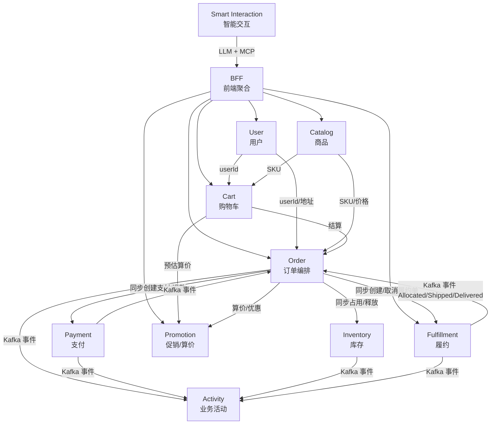

# HMall 上下文地图（Context Map）

描述各限界上下文及其之间的关系。上下游关系与集成方式会随实现演进更新。

---

## 架构与部署

- **部署形态**：每个 BC 为独立微服务，各自独立部署、独立扩展
- **当前实现**：模块化单体（Modular Monolith），各 BC 以包/模块共存，BC 边界与未来服务边界对齐

### 集成技术

| 方式 | 用途 | 技术 |
|------|------|------|
| **BFF** | 前端统一 API 入口，按路径前缀代理到各 BC | HTTP 透传（端口 8085），Vite proxy `/api` → BFF |
| **REST** | BC 间同步调用（Order/Cart → Promotion，Order → Catalog/User/Inventory/Payment/Fulfillment） | HTTP + JSON |
| **事件** | BC 间异步编排（PaymentCompleted、FulfillmentDelivered 等） | **Kafka**（支持事件持久化、重放、多消费者） |

事件的完整定义（事件流、事件总表、约定）见 [business-flows.md](business-flows.md)。

### 形态演进

| 形态 | 前端接入 | REST（BC 间） | 事件 |
|------|----------|---------------|------|
| **当前** | BFF 代理 | REST/HTTP（localhost） | Kafka |
| **微服务** | BFF + 服务发现 | HTTP + 服务发现 | Kafka |

---

## 上下文概览



---

## 上下文说明

| 上下文 | 职责 |
|--------|------|
| **Catalog** | 类目、商品(SPU)、规格维度、SKU、展示图、商品类型与服务绑定、镭雕图案库（EngravingPattern） |
| **User** | 用户注册、登录(JWT)、收货地址管理 |
| **Order** | 订单创建、取消、查询、事件驱动、状态流转 |
| **BFF** | 前端统一 API 入口，按路径前缀代理到各 BC；透传代理、CORS、错误转发 |
| **Smart Interaction** | LLM + MCP 智能交互（对话式操作） |
| **Cart** | 购物车增删改查、结算预览；结算由前端编排到 Order |
| **Inventory** | 库存占用与释放 |
| **Payment** | 扣款、退款、支付超时检测 |
| **Promotion** | 优惠券、促销活动、价格计算（端口 8090） |
| **Fulfillment** | 拆单、配货、发货、配送、镭雕完成与事件通知 |
| **Activity** | 消费各 BC 事件，构建业务活动记录（审计、统计、监控） |

---

## 集成关系

| 上游 | 下游 | 集成方式 | 说明 |
|------|------|----------|------|
| BFF | Catalog | REST | 代理 /api/categories、/api/products 等 |
| BFF | User | REST | 代理 /api/users、/api/login |
| BFF | User | REST | 🔄 代理用户管理新路由：/api/users/{id}/level、/api/users/{id}/tags、/api/users/segment-rules**（来自用户分群与圈选需求） |
| BFF | Order | REST | 代理 /api/orders |
| BFF | Cart | REST | 代理 /api/cart |
| BFF | Fulfillment | REST | 代理 /api/fulfillment |
| BFF | Promotion | REST | 代理 /api/promotion（券模板、活动管理、算价、活动价预估） |
| Smart Interaction | BFF | LLM + MCP Tool Calling | Smart Interaction 调 LLM API → MCP Server → BFF API（与前端相同入口） |
| Catalog | Order | REST | Order 创建时按 skuId 拉取 SKU 与价格；按 spuId 查可选服务 |
| User | Order | REST | userId、收货地址 |
| Catalog | Cart | REST | 添加时校验 SKU 存在性；查询时拉取展示信息（名称、价格、图片） |
| User | Cart | userId | 购物车按用户隔离 |
| Cart | Order | 前端编排 | 前端从 Cart 取选中项 → 调用 Order API 创建订单 → 清理已下单项 |
| Order | Inventory | REST/同步 | 创建订单时同步占用；取消时同步释放 |
| Order | Payment | REST/同步 | 创建订单时同步创建支付单；取消时同步退款 |
| Cart | Promotion | 同步调用 | 结算预览时调用统一算价，返回活动优惠与实付 |
| Order | Promotion | 同步调用 | 创建订单时统一算价（活动+券）、锁定/核销/释放优惠券 |
| Promotion | User | 同步调用 | 🔄 用户定向算价时查询 user level/tags（来自用户定向与满件折扣需求） |
| User | Promotion | 领域数据供给 | 🔄 User 作为分群主数据源，Promotion 只消费实时分群结果（来自用户分群与圈选需求） |
| Order | Fulfillment | REST/同步 | 创建履约单（PaymentCompleted 后同步调用，返回 fulfillmentOrderIds）；取消履约单（Order 补偿时同步调用） |
| Payment | Order | Kafka 事件 | PaymentCompleted / Failed / Expired（Order 通过 KafkaPaymentEventConsumer 消费）；PaymentFailed 不影响订单状态（用户可重试），仅 PaymentExpired 触发取消 |
| Fulfillment | Order | Kafka 事件 | FulfillmentOrderAllocated / Shipped / Delivered（Order 消费后推进状态）；FulfillmentOrderCreated 仅 Activity 消费 |
| Order | Activity | Kafka 事件 | OrderCreated / Cancelled / Completed |
| Payment | Activity | Kafka 事件 | PaymentCompleted / Failed / Expired |
| Inventory | Activity | Kafka 事件 | StockReserved / StockReleased |
| Fulfillment | Activity | Kafka 事件 | FulfillmentOrderCreated / Allocated / Shipped / Delivered / EngravingCompleted |

---

## 业务流程与事件

端到端业务流程（价值流、事件流、路径枚举、测试覆盖映射）见 **[business-flows.md](business-flows.md)**。

业务流程体系（一级流程定义、事件分类与管理、智能化分层、演进路线）见 **[business-process-architecture.md](business-process-architecture.md)**。

---

## 文档位置

```
docs/
├── context-map.md           # 本文件 - 系统结构、集成关系、集成技术
├── business-flows.md        # 业务流程 - 价值流、事件流、事件总表、路径枚举、测试覆盖
├── business-process-architecture.md  # 业务流程架构 - 流程体系、事件分类、智能化、演进路线
├── design-principles.md     # 设计原则
├── project-status.md        # 项目状态
├── bounded-contexts/        # 各 BC 文档（requirements、domain-model、api.yaml 等）
├── business-requirements/   # 跨 BC 业务需求方案
├── frontend/                # 前端文档（ui-spec、testing）
```
