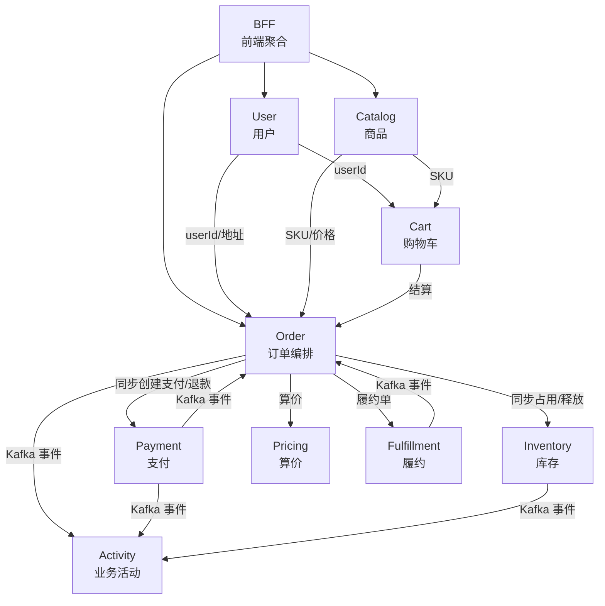
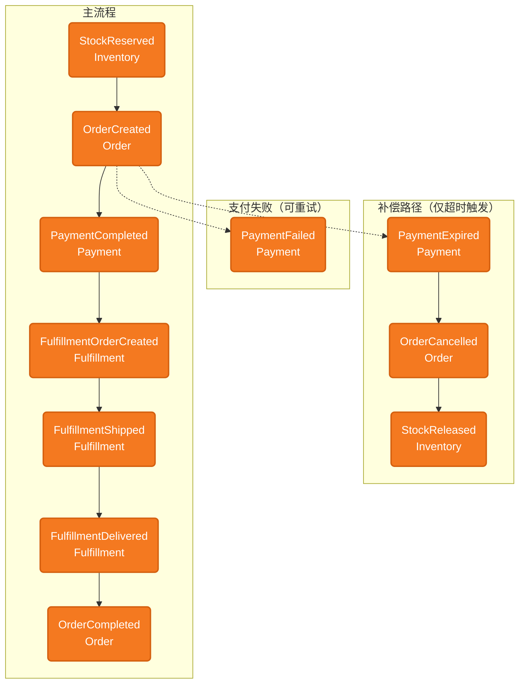

# HMall 上下文地图（Context Map）

描述各限界上下文及其之间的关系。上下游关系与集成方式会随实现演进更新。

> 进度与路线图见 [project-status.md](project-status.md)；本图侧重 BC 间关系与集成方式。

---

## 架构与部署

- **部署形态**：上下文地图中的每个限界上下文（BC）均为**独立微服务**，各自独立部署、独立扩展。
- **当前实现**：模块化单体（Modular Monolith），各 BC 以包/模块形式共存于同一应用，BC 边界与未来服务边界对齐。
- **集成技术**：REST 用于同步调用；事件用于异步编排。事件总线的具体技术选型见 [integration.md](architecture/integration.md)。

---

## 上下文概览



---

## 上下文说明

| 上下文 | 职责 | 状态 | 与 project-status 对应 |
|--------|------|------|------------------------|
| **Catalog** | 类目、商品(SPU)、规格维度、SKU、展示图 | ✅ 已实现 | 4 feature，45 scenario |
| **User** | 用户注册、登录(JWT)、收货地址管理 | ✅ 已实现 | 3 feature，19 scenario |
| **Order** | 订单创建、取消、查询、事件驱动、状态流转 | ✅ 已实现 | 4 feature，23 scenario |
| **BFF** | frontend 统一 API 入口，代理 Catalog/User/Order/Inventory | ✅ POC 完成 | 透传代理、CORS、4xx/5xx 转发 |
| **Cart** | 购物车管理 | 🔲 规划中 | 依赖 Catalog + User，按需实现 |
| **Inventory** | 同步占用/释放库存 | ✅ 已实现并已与 Order 集成 | Order 同步调用 occupy/release |
| **Payment** | 扣款/退款/超时检测 | 🔄 开发中 | 5 feature、19 scenario 全绿；超时检测定时自动执行；事件通知 Order（Kafka） |
| **Pricing** | 算价、优惠 | 🔲 规划中 | 同步调用 |
| **Fulfillment** | 拆单、发货、配送 | 🔲 规划中 | Order 以 Port 桩对接 |
| **Activity** | 消费各 BC 事件，构建业务活动记录（审计、统计、监控） | 🔄 骨架已建 | 订阅 Order/Payment/Inventory Kafka 事件 |

---

## 集成关系

| 上游 | 下游 | 集成方式 | 说明 |
|------|------|----------|------|
| BFF | Catalog | REST | 代理 /api/categories、/api/products 等 |
| BFF | User | REST | 代理 /api/users、/api/login |
| BFF | Order | REST | 代理 /api/orders |
| Catalog | Order | REST | Order 创建时按 skuId 拉取 SKU 与价格 |
| User | Order | REST | userId、收货地址 |
| Catalog | Cart | REST（规划） | SKU 信息 |
| User | Cart | REST（规划） | userId |
| Cart | Order | 未来 | 购物车结算 → 创建订单 |
| Order | Inventory | REST/同步 | 创建订单时同步占用；取消时同步释放 |
| Order | Payment | REST/同步 | 创建订单时同步创建支付单；取消时同步退款 |
| Order | Pricing | 同步调用 | 创建订单时算价 |
| Order | Fulfillment | 事件 | PaymentCompleted → 创建履约单 |
| Payment | Order | Kafka 事件 | PaymentCompleted / Failed / Expired（Order 通过 KafkaPaymentEventConsumer 消费）；PaymentFailed 不影响订单状态（用户可重试），仅 PaymentExpired 触发取消 |
| Fulfillment | Order | Kafka 事件 | FulfillmentOrderCreated / Shipped / Delivered（Order 通过 KafkaFulfillmentEventConsumer 消费） |
| Order | Activity | Kafka 事件 | OrderCreated / Cancelled / Completed |
| Payment | Activity | Kafka 事件 | PaymentCompleted / Failed / Expired |
| Inventory | Activity | Kafka 事件 | StockReserved / StockReleased |

---

## 交易事件流（端到端）

以事件风暴视角展示交易全生命周期。图中所有节点均为**领域事件**（🟧 橙色），箭头表示因果关系；触发每个事件的 Command 与 Policy 见下方「系统事件总表」的**触发**列。

所有事件以 **orderId** 为关联键，贯穿 Order、Inventory、Payment、Fulfillment 四个 BC；Activity BC 作为观察者订阅全部事件。

> 实线 = Happy Path　虚线 = 失败 / 超时 → 补偿路径。节点内第一行为事件名，第二行为 BC。



**上**：补偿路径（支付超时 → 取消 → 释放库存）。**下**：主流程（下单 → 支付成功 → 履约 → 完成）。PaymentFailed 不触发取消（用户可重试支付），仅 PaymentExpired 触发补偿路径。用户主动取消（⌘ CancelOrder）触发的事件与补偿路径相同。

---

## 系统事件总表

所有跨 BC 领域事件的完整目录。**设计决策：orderId 是系统级关联键**——每个 BC 发布的事件都携带 orderId，Order 是交易的中心聚合，Payment、Reservation、FulfillmentOrder 都因订单而生。Activity BC 利用 orderId 将不同来源的事件串联为同一笔交易的事件时间线。

### Order 发布

| 事件 | 触发 | 业务实体 | 与 Order 关系 | Topic | 订阅方 | 关键 Payload |
|------|------|----------|---------------|-------|--------|-------------|
| OrderCreated | ⌘ PlaceOrder | Order | 自身（聚合根） | `order.created` | Activity | orderId, items[{skuId, quantity}], occurredAt |
| OrderCancelled | ⟳ PaymentFailed / Expired 或 ⌘ CancelOrder | Order | 自身 | `order.cancelled` | Activity | orderId, occurredAt |
| OrderCompleted | ⟳ FulfillmentDelivered | Order | 自身 | `order.completed` | Activity | orderId, occurredAt |

### Payment 发布

| 事件 | 触发 | 业务实体 | 与 Order 关系 | Topic | 订阅方 | 关键 Payload |
|------|------|----------|---------------|-------|--------|-------------|
| PaymentCompleted | 网关支付成功回调 | Payment | 1:1（一笔订单一笔支付单） | `payment.completed` | Order, Activity | orderId, paymentId, occurredAt |
| PaymentFailed | 网关支付失败回调 | Payment | 1:1 | `payment.failed` | Order, Activity | orderId, occurredAt（Order 收到后不变更状态，用户可重试支付） |
| PaymentExpired | ⟳ Payment 超时检测（定时任务） | Payment | 1:1 | `payment.expired` | Order, Activity | orderId, occurredAt |

### Inventory 发布

| 事件 | 触发 | 业务实体 | 与 Order 关系 | Topic | 订阅方 | 关键 Payload |
|------|------|----------|---------------|-------|--------|-------------|
| StockReserved | ⌘ PlaceOrder → Inventory.occupy（同步） | Reservation | 1:1（一笔订单一次占用） | `inventory.stock.reserved` | Activity | orderId, items[{skuId, quantity}], occurredAt |
| StockReleased | ⟳ 取消补偿 或 ⌘ CancelOrder → Inventory.release（同步） | Reservation | 1:1 | `inventory.stock.released` | Activity | orderId, occurredAt |

### Fulfillment 发布（规划中）

| 事件 | 触发 | 业务实体 | 与 Order 关系 | Topic | 订阅方 | 关键 Payload |
|------|------|----------|---------------|-------|--------|-------------|
| FulfillmentOrderCreated | ⟳ PaymentCompleted → Order 创建履约单 | FulfillmentOrder | 1:N（一笔订单可拆多个履约单） | `fulfillment.order.created` | Order, Activity | orderId, fulfillmentOrderIds, occurredAt |
| FulfillmentShipped | Fulfillment 内部发货流程 | FulfillmentOrder | 1:N | `fulfillment.shipped` | Order, Activity | orderId, occurredAt |
| FulfillmentDelivered | Fulfillment 内部配送完成 | FulfillmentOrder | 1:N | `fulfillment.delivered` | Order, Activity | orderId, occurredAt |

### 事件通用约定

| 约定 | 说明 |
|------|------|
| 关联键 | orderId——交易的中心聚合标识 |
| 幂等键 | eventId（UUID），发布方生成；Activity 以此去重 |
| 消息格式 | JSON：eventType, orderId, 业务字段, occurredAt |
| 传输 | Kafka；Topic 命名 `<bc>.<event-type>` |
| 消费语义 | at-least-once，消费方保证幂等 |

### Activity 消费全景

Activity BC 订阅全部事件，以 orderId 为维度提供事件时间线查询与统计仪表盘。

| 来源 BC | 订阅 Topic | 已接入 |
|---------|-----------|--------|
| Order | `order.created` / `cancelled` / `completed` | ✅ |
| Payment | `payment.completed` / `failed` / `expired` | ✅ |
| Inventory | `inventory.stock.reserved` / `stock.released` | ✅ |
| Fulfillment | `fulfillment.order.created` / `shipped` / `delivered` | 🔲 待上线 |

---

## 文档位置

```
docs/
├── context-map.md           # 本文件 - 系统 BC 总览
├── design-principles.md     # 系统设计原则
├── project-status.md        # 项目状态与路线图
├── architecture/
│   ├── integration.md       # 集成技术选型（REST、事件总线等）
│   └── event-driven-business-analysis.md  # 事件驱动业务分析方法
├── bounded-contexts/
│   ├── catalog/
│   ├── user/
│   ├── order/
│   ├── inventory/
│   ├── bff/
│   └── ...
├── frontend-admin/
└── frontend-web/
```
