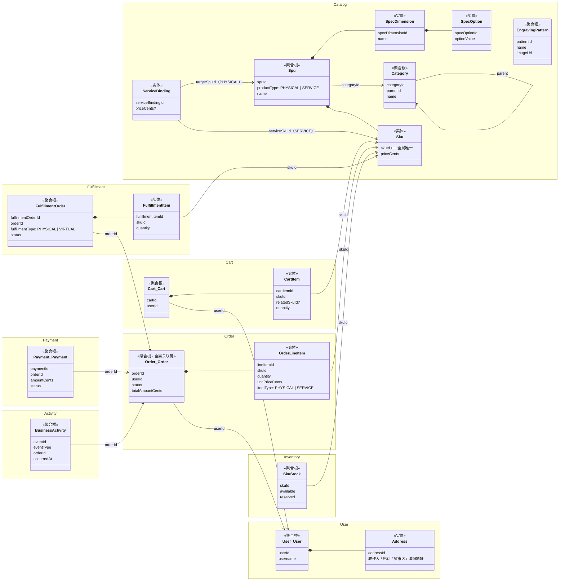
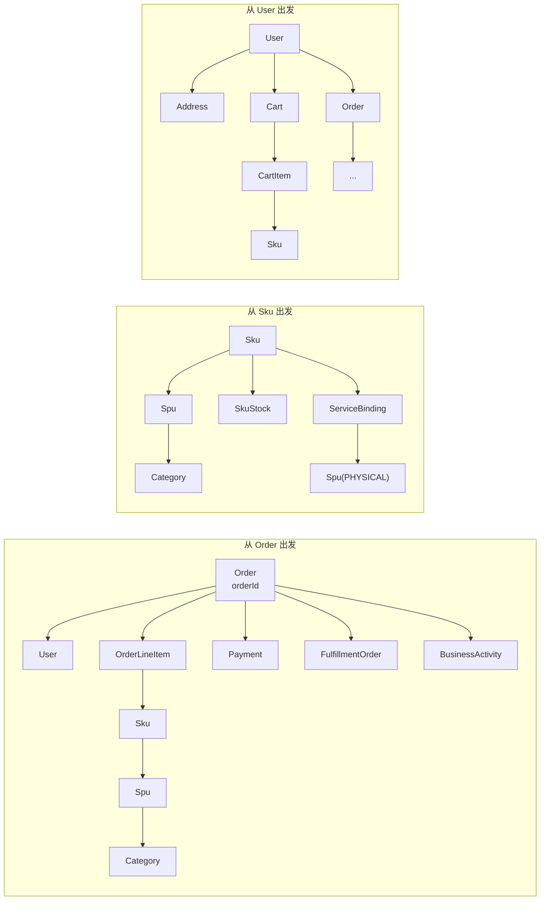

# HMall 电商本体 — 对象关系图

> 对象类型与关联关系的可视化表达。文本版本见 [ontology.md](./ontology.md)。

## 全景图

## 图例

| 符号 | 含义 |
|------|------|
| `*--` | 组合（聚合内部，生命周期一致） |
| `-->` | 引用（跨聚合 / 跨 BC，通过 ID 关联） |
| `<<聚合根>>` | 聚合根，业务一致性边界 |
| `<<实体>>` | 聚合内部实体 |
| 命名空间色块 | 限界上下文（BC）边界 |

## 核心导航路径

