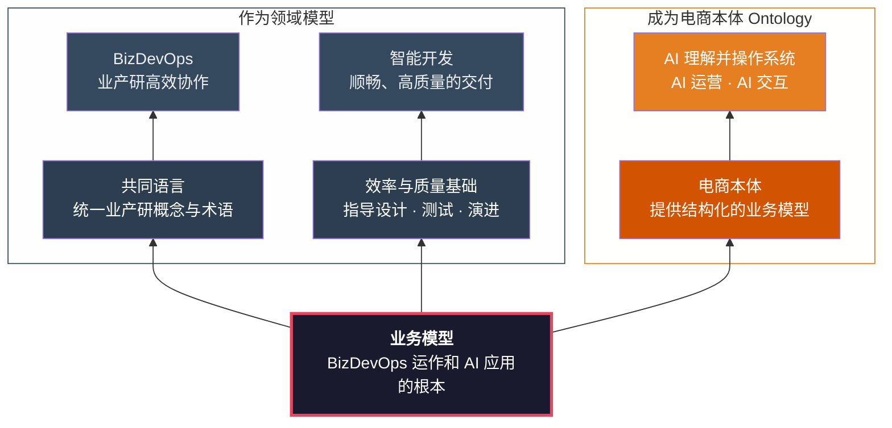

# 模型是一切的根本

## 一张图

**领域模型**在最底层，是基座。从它向上生长出两个面：作为领域模型本身，为组织提供共同语言和效率与质量的基础；转化为系统本体后，成为 AI 理解和操作系统的基座。

---

## 作为领域模型

### 共同语言 → BizDevOps

一个组织里，业务说"商品"，产品说"SKU"，开发说"spu 表"——同一个东西，三种叫法。误解不是因为能力不够，而是因为没有共同语言。

领域模型就是这套语言。它定义了：

- **什么是 SPU？什么是 SKU？** SPU 是一个商品（如 Mate 70），SKU 是它的一个规格变体（如"曜石黑 12+256G ¥5499"）。
- **什么是"下单"？** 不是"往数据库插一条记录"，而是"占库存 → 创建支付单 → 发布订单创建事件"这一整套业务动作。
- **什么是"履约"？** 实体商品走物流配送，虚拟服务走即时激活，混合订单拆成两个履约单各自推进。

当业务、产品、开发都用同一套概念对话时，需求从传递到实现的失真会大幅降低。BizDevOps 不是靠流程串联，而是靠说同一种语言。

### 效率与质量基础 → 高效开发 · 高质量交付与运营

模型不只是文档，它直接映射到代码结构。

每一个模型中的概念——Order、Payment、FulfillmentOrder——在代码中都有对应的类、表、API。模型里说"一个订单可以对应多个履约单"，代码里就是 `Order 1:N FulfillmentOrder`。模型里说"支付失败不取消订单，用户可重试"，测试里就有一个验证这条规则的用例。

这意味着：

- **模型是设计的依据。** 开发不需要猜"这个功能应该放在哪个服务里"——模型的限界上下文边界已经回答了这个问题。
- **模型是测试的基线。** 每一条业务规则都可以追溯到模型中的一条不变式，测试验证的就是这些不变式是否成立。
- **模型是演进的锚点。** 新需求来了，先看它影响模型的哪个部分，再决定改什么代码。而不是反过来——先改代码，再发现模型已经对不上了。

没有模型的代码是一堆技术实现；有模型的代码是业务逻辑的精确表达。前者越改越乱，后者越改越清晰。

---

## 成为系统本体

当我们把领域模型结构化地暴露出来——定义系统中有哪些对象、对象之间什么关系、每个对象可以用哪些工具操作——它就成了系统的**本体（Ontology）**。

本体让 AI 不再是"调 API 的机器人"，而是一个**理解业务语义的协作者**：

- AI 知道"订单"不只是一条数据，它关联着用户、支付、履约，可以从 orderId 导航到整个业务上下文。
- AI 知道"库存占用"不是它该直接调用的操作——那是下单时系统自动编排的，它只需要调 `order_create`。
- AI 知道"服务商品"加入购物车时必须关联一个实体商品的 SKU，不会遗漏 `relatedSkuId`。

**没有本体，AI 只能执行指令。有了本体，AI 能够理解意图。**

从"帮我查一下这个订单"到"帮客户处理这个售后问题"——这中间的差距，不是 AI 模型的能力差距，而是 AI 对业务理解深度的差距。本体就是填补这个差距的桥梁。有了它，AI 运营和 AI 交互才成为可能。

---

## 所以

模型不是开发团队的内部文档，不是可有可无的设计产物。

作为领域模型，它是组织的共同语言，是开发效率与交付质量的基础。
成为系统本体，它是 AI 理解业务、操作系统的前提。

**两个面，一个根。投资模型，就是同时投资 BizDevOps 和 AI 能力。**
